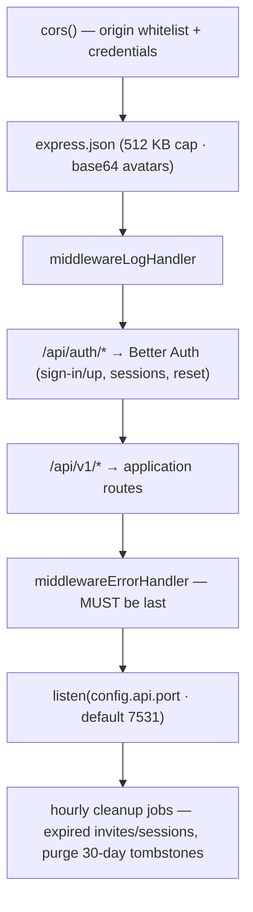
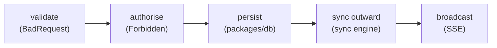

import { Aside, Steps } from '@astrojs/starlight/components';

The backend is a plain **Express** server in `apps/api/`. No framework magic — routes, middleware, handlers, and a thin permission layer. This page gives you the mental model and the exact pattern every handler follows.

## Boot sequence

`apps/api/src/index.ts` is the front door. It wires the app in this order (order matters):



Two route namespaces exist and never overlap:

- **`/api/auth/*`** — entirely owned by Better Auth (email/password + native Google/Apple sign-in). Don't add routes here. See [Authentication](/docs/architecture/authentication/).
- **`/api/v1/*`** — the application API. Everything you add goes here.

<Aside type="caution">
Route order within a namespace matters — Express matches in registration order. `GET /api/v1/calendars/google` is registered **before** `GET /api/v1/calendars/:id`, otherwise `:id` would swallow `google`. When adding a static path that collides with a param route, register it first.
</Aside>

## The handler rhythm

Every mutating handler follows the same five beats. Internalise this and the whole backend reads identically:



A representative handler (`handlerCreateEvent` in `handlers/events.ts`):

```ts
export async function handlerCreateEvent(req: Request, res: Response) {
  const event = EventSchema.parse(req.body);          // 1. validate (throws BadRequest)
  event.creatorID = req.user!.id;                       //    never trust client for identity
  await assertCan(req.user!.id, event.calendars[0], "editEvents"); // 2. authorise
  const created = await createEvent(event, event.calendars);       // 3. persist (packages/db)
  await pushEventToProviders(created, "create");        // 4. sync outward (Google/Outlook/CalDAV)
  notifyCalendarMembers(memberIds, "event_created", created);       // 5. broadcast
  res.status(201).json(created);
}
```

Conventions baked into that snippet:

- **`req.user`** is set by the `requireAuth` middleware (type augmented in `apps/api/src/express.d.ts`). Public routes omit `requireAuth`.
- **Identity fields (`creatorID`, `originCalendarID`) are set server-side**, never taken from the client body. `handlerUpdateEvent` strips them: `const { creatorID, originCalendarID, ...editable } = event`.
- **Handlers throw; they don't return error responses.** A `wrap()` helper (`const wrap = h => (req,res,next) => Promise.resolve(h(req,res)).catch(next)`) funnels rejected promises into the error middleware. That's why every route is `wrap(handlerX)`.

## Errors → HTTP status

Handlers throw the typed error classes from `@musubi/types` (`errors.ts`). `middlewareErrorHandler` maps them:

| Thrown | Status |
|---|---|
| `BadRequestError` | 400 |
| `UnauthorizedError` | 401 |
| `ForbiddenError` | 403 |
| `NotFoundError` | 404 |
| anything else | 500 |

```ts
if (!event) throw new NotFoundError("Event not found...");
if (start > end) throw new BadRequestError("Start must precede end.");
```

Query modules return `undefined`/`[]` for "not found" — the handler decides whether that's a 404.

## Structured logging

The shared logger exported by `@musubi/config` emits one JSON object per line.
`middlewareLogHandler` assigns every request an `x-request-id`, stores it in an
`AsyncLocalStorage` context, and returns it as a response header. Logs produced
deeper in auth, handlers, or sync automatically carry that id; authenticated
requests also carry the internal `userId`. Route patterns are logged instead of
concrete URLs so invite and auth tokens in paths are not exposed. Request bodies,
credentials, and bearer tokens are never logged.

`LOG_LEVEL` accepts `debug`, `info`, `warn`, `error`, or `silent` and defaults to
`info`. Successful HTTP requests are `info`, 4xx responses are `warn`, and 5xx
responses are `error`. Provider-sync counts and timings are `debug`; turn that
level on temporarily when diagnosing Google, Outlook, or CalDAV without making normal
production logs excessively noisy.

## Prometheus metrics

The API exposes Prometheus data from a separate internal listener rather than a
route on the public API. `METRICS_PORT` defaults to `9464`; `0` disables the
listener. `GET /metrics` contains the standard `prom-client` Node.js/process
metrics (prefixed `musubi_`) and these application metrics:

| Metric | Meaning |
|---|---|
| `musubi_http_requests_total` | Completed requests by method, registered route pattern, and status |
| `musubi_http_request_duration_seconds` | Request-duration histogram using the same bounded labels |
| `musubi_http_requests_in_flight` | Requests currently being processed by method |
| `musubi_external_sync_failures_total` | Failed provider discovery, account sync, event push, or scheduler runs by provider |

Unknown HTTP methods collapse to `OTHER`, unmatched paths collapse to
`<unmatched>`, and registered Express patterns are used instead of concrete
URLs. This bounds label cardinality and prevents identifiers or tokens in paths
from entering the monitoring system. The Dokploy Compose network alias is
`musubi-api`; Prometheus on the same Docker network scrapes
`musubi-api:9464/metrics` without exposing the listener through Traefik.
Ready-to-use availability, HTTP 5xx, and provider-sync alert rules live in
`ops/prometheus/musubi-alerts.yml`.

### The server trusts nothing from the client

Client-side checks (the composer's validation, the same-server guard, federation routing) are **UX only** — every guarantee is re-established here:

- **`assertCan`/`canDo` double as existence checks.** A calendar id with no membership row yields a null role → `ForbiddenError`. Since every calendar id a mutation touches passes through one of these gates *before* any insert, an unknown or foreign id gets a clean 403 — never an FK violation.
- **`handlerCreateEvent` validates the event's shape**: at least one calendar, and `originCalendarID` must be **one of the linked calendars** (defaulting to the first). The home calendar governs edit rights, so a client must not be able to smuggle in a foreign calendar as origin — and since the linked calendars are membership-verified, this also proves the origin exists (clean 400 instead of an FK 500).
- **Identity fields are overwritten server-side** (`creatorID` on create, `creatorID`/`originCalendarID` stripped on update), as described above.

## Permissions

Two files, two responsibilities:

- **`packages/types/src/permissions.ts`** — the *truth*: the `CalendarRole` × `CalendarAction` matrix and the pure `can(role, action)` function. Shared with the client so UI can hide what the user can't do.
- **`apps/api/src/permissions.ts`** — the *server gates* that call it against the DB.

| Role | Allowed actions |
|---|---|
| `owner` | editCalendar, deleteCalendar, manageMembers, editEvents, invite |
| `editor` | editEvents, invite |
| `viewer` | *(read-only)* |

Three gate functions:

- `assertCan(userID, calendarID, action)` — throws `ForbiddenError` if not allowed. The default gate.
- `canDo(userID, calendarID, action): Promise<boolean>` — non-throwing, for branching (e.g. "unlink only the calendars you *can* edit").
- `assertCanEditEvent(userID, eventID)` — the **home-calendar** gate. Edit rights follow `originCalendarID`, not whichever calendar you're viewing the event through. Falls back to the creator if the home calendar was deleted.

<Aside type="caution">
The single most important permission rule: **an event is editable only through its home calendar.** A shared event visible in five calendars can only be edited by editors/owners of its `originCalendarID`. This is what prevents conflicting edits across shared views. Any new event-mutating endpoint must call `assertCanEditEvent`, not a plain `assertCan` on the viewing calendar.
</Aside>

## Link vs Fork

The two signature endpoints in `handlers/events.ts`, both `POST /api/v1/events/:eventId/{link|fork}`:

- **Link** (`handlerLinkEvent`) — adds an existing event to another calendar. Requires you can *see* the event and can *edit* the target calendar. One event row, a new `calendar_events` link. Ownership (`originCalendarID`) is unchanged. Broadcasts `event_updated` to all members of all linked calendars.
- **Fork** (`handlerForkEvent`) — creates an independent copy: new UUID, new `creatorID`, new `originCalendarID`. Fully divergent from the original. Broadcasts `event_created` to the target.

Rule of thumb: *Link* to share one truth; *Fork* to claim your own version.

## Attendees

Attendance is per-event opt-in: the `events.hasAttendees` flag (set in the composer at create/edit) gates the client UI only — the endpoints below don't check it, and flipping it off is non-destructive (`event_users` rows survive, re-enabling restores the list).

`GET /events/:id/attendees` and `PUT /events/:id/attendance` (`{ attending: boolean }`, idempotent — the client sends desired state). Both gate on `assertCanViewEvent` (membership in *any* linked calendar) — viewers RSVP too. Responses carry `{ id, name, image }` only, no emails: an event can span calendars whose members aren't mutuals. Attendance changes broadcast an `attendance_changed` SSE frame (`{ eventID, attendees }`) to members of all linked calendars, so an open detail modal updates live; the client keeps lists in `useAttendeesStore`, fetched fresh on modal open.

## Realtime (SSE)

`GET /api/stream` is a long-lived [Server-Sent Events](https://developer.mozilla.org/docs/Web/API/Server-sent_events) connection, registered **outside** the `/api/v1` prefix to match the client's URL. `handlerStream` sets the SSE headers and stores the response in a `Map<userID, Response>`; `notifyCalendarMembers(userIds, type, payload)` writes `event_created` / `event_updated` / `event_removed` / `calendar_updated` / `calendar_removed` / `attendance_changed` / `external_sync` frames to the affected users. Every mutating handler calls it after persisting — so a change one member makes appears live for the others — and the [scheduled provider sync](/docs/architecture/sync/#near-realtime-the-scheduled-sync) sends `external_sync` when provider changes land, which clients answer with a silent delta refresh.

It's an authenticated route (`requireAuth`): the client sends its session as a `Bearer` token, which Better Auth's bearer plugin validates. The client subscribes via `react-native-sse` (`apps/client/hooks/useEventsStream.ts`).

<Aside type="note">
Broadcasts are **best-effort and fire-and-forget** — there is no server-side replay buffer; the delta sync is the durable path, SSE is the live-nicety on top. The client library (`react-native-sse`) auto-reconnects every 5 s after an error or stream end, and the hook runs one silent delta refresh on the reconnect that follows an error to catch up on frames missed while down. The hook also opens a stream **per federated server** from the registry (member token as bearer — `requireAuth`'s fallback authenticates it), so remote calendars' events and attendance update live too.
</Aside>

## Route map

| Group | Routes |
|---|---|
| Health | `GET /api/v1/server`, `/server/ok` *(public)* |
| Events | `GET/POST/PUT/DELETE /api/v1/events`, `POST /api/v1/events/:id/link`, `/fork`, `GET /events/:id/attendees`, `PUT /events/:id/attendance` |
| Calendars | `GET/POST/PUT/DELETE /api/v1/calendars`, `GET /calendars/:id`, `/calendars/google`, `/calendars/tokens/:token`, `GET /calendars/:id/export` (.ics snapshot, any member), `POST /calendars/import` (raw .ics body → new native calendar; own 10 MB text parser) |
| Members | `GET /calendars/:id/members`, `POST/DELETE /calendars/members/:id` (join/leave), `PUT/DELETE /calendars/:id/members/:userId` (role/kick) |
| Invites | `POST /calendars/invites` (create — `expiresAt: null` = never, `maxUses: null` = unlimited), `GET /calendars/:id/invites` (list, with `uses`), `DELETE /calendars/invites/:inviteId` (revoke) — all gated on the `invite` action |
| Users | `GET/PUT /users/settings`, `DELETE /users`, `POST /users/avatar`, `GET /users/:id/avatar` *(public)* |
| Connections | google check/revoke, caldav check/connect/disconnect, `GET/POST/DELETE /users/connections/musubi` (federated connections, roaming), `POST /users/connections/disconnect` |
| Federation | `POST /api/v1/federation/accept` *(public — the invite token is the credential)*, `GET /invite/:token` *(public HTML hand-off page, outside `/api`)* — see [Federation](/docs/architecture/federation/) |

`GET /api/v1/server` is public and returns `{ minClientVersion, socials }` — `socials` lists the social logins this server has credentials for (e.g. `["google"]`), so the client's welcome screen renders only the buttons that will work against it (matters for self-hosted servers with a partial config).

`POST /calendars` can carry `provider` + `accountId` to create the calendar **into a connected account** — the server creates it at the provider first, then imports the mirror (see [Calendar-level writes](/docs/architecture/sync/#calendar-level-writes)). `PUT`/`DELETE /calendars` on an external mirror push the rename/recolor/delete to the provider first and abort locally if it refuses.

Two auth notes: `GET /calendars/tokens/:token` is **public** (possession of the unguessable invite token is the credential — cross-server invitees have no session here). The token is fully validated at every read by `getCalendarIDFromToken`: uuid-shaped (a raw string against a uuid column would be a PG 500), unexpired, and under its `maxUses` — and the two public token endpoints (`/calendars/tokens/:token`, `/federation/accept`) sit behind a per-IP in-memory `rateLimit` middleware so tokens can't be farmed or guessed. And `requireAuth` has a second path: when no Better Auth session matches, it hashes the presented `Bearer` and looks it up in `member_tokens` — authenticating a federated **shadow member**. Authorization still runs through `calendar_members` on every route, so this fallback grants nothing by itself.

<Aside type="note">
`POST /api/v1/users/reset` is public and its inline comment says "password reset entry" — but it maps to `handlerResetUsers`, the **dev-only** full user wipe (guarded by `ENVIRONMENT === "dev"`, throws `Forbidden` otherwise). The comment is misleading; real password reset is a Better Auth route under `/api/auth`. Worth a cleanup.
</Aside>

## How to add an endpoint

<Steps>

1. **Write the handler** in the right `handlers/*.ts` file. Follow the five-beat rhythm — validate (throw `BadRequestError`), authorise (`assertCan*` → `ForbiddenError`), persist (a `@musubi/db` query, throw `NotFoundError` on missing), sync outward if it touches events (`pushEventToProviders`), broadcast (`notifyCalendarMembers`), respond (`201` create / `200` update).

2. **Add a query function** in `packages/db/src/queries/*.ts` if you need new DB access — never inline `db.select` in a handler.

3. **Register the route** in `index.ts`, before `middlewareErrorHandler`, wrapped and (usually) authed:
   ```ts
   app.put("/api/v1/events/:eventId/reschedule", requireAuth, wrap(handlerRescheduleEvent));
   ```
   Watch route order if the path could collide with a `:param` route.

4. **Add the client method** in `apps/client/services/api.ts` (see the [client guide](/docs/architecture/client/#the-useapi-hook)) and call `throwOnError(error)` after the fetch.

5. **Typecheck** both apps: `cd apps/api && npx tsc --noEmit --skipLibCheck`.

</Steps>

## Gotchas worth knowing

- **Body limit is 512 KB** (base64 avatars). Larger payloads 413.
- **Avatar upload sniffs magic bytes** — no extension trust; served from a public, timestamp-versioned URL (`<Image>` can't send auth headers).
- **Owner can't leave** a calendar (`handlerLeaveCalendar` blocks it) — transfer ownership or delete. Prevents orphaned calendars.
- **Invites are token-based, not email-based** — `handlerJoinCalendar` requires a token matching the calendar, preventing ID enumeration.
- **Broadcasts target all members of affected calendars**, deduped via a `Set`, not just the requester.
