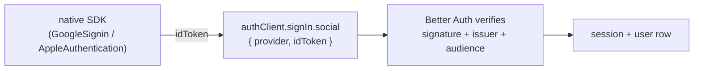

import { Aside, Steps } from '@astrojs/starlight/components';

Auth is **[Better Auth](https://www.better-auth.com/)**, configured once in `packages/auth/src/lib/auth.ts` and mounted at `/api/auth/*` (owned entirely by Better Auth — don't add routes there). Three ways in:

- **Email + password** — classic; password reset emails go through SMTP.
- **Google** — *native* Sign-In via an id token (no web redirect, no Firebase).
- **Apple** — *native* Sign in with Apple via an identity token (iOS only).

<Aside type="note">
Social sign-in here is **id-token based**, not the OAuth authorization-code redirect flow. The native SDK on the device produces a signed token; the client hands it to the server, which verifies it. This is a different thing from *connecting a Google Calendar for sync* (that one **is** a redirect flow — see [below](#google-calendar-connection-is-not-sign-in)).
</Aside>

## The native id-token flow



Client side (`apps/client/app/(auth)/welcome.tsx`):

```ts
// Google
const { data } = await GoogleSignin.signIn();
await authClient.signIn.social({ provider: "google", idToken: { token: data.idToken } });

// Apple (iOS only)
const cred = await AppleAuthentication.signInAsync({ requestedScopes: [FULL_NAME, EMAIL] });
await authClient.signIn.social({ provider: "apple", idToken: { token: cred.identityToken } });
```

Server side (`packages/auth/src/lib/auth.ts`) — what each provider verifies the token's **audience** against:

| Provider | `clientId` | Verified audience | Why |
|---|---|---|---|
| Google | `EXPO_PUBLIC_GOOGLE_WEB_CLIENT_ID` (the **web** id) | the web client id | `@react-native-google-signin` mints the id token with the *web* client as audience when `webClientId` is set, so the backend can verify it |
| Apple | `APPLE_CLIENT_ID` | `appBundleIdentifier` (`dev.frgtn.musubi`) | a native Apple identity token's `aud` is the app's bundle id — Better Auth checks against `appBundleIdentifier` first (see `@better-auth/core` `apple.ts`) |

`clientSecret`/the web redirect endpoints are **never exercised** by the native flow. Apple's `appBundleIdentifier` is the load-bearing field; `APPLE_CLIENT_ID` mostly acts as the on/off toggle (see discovery below).

<Aside type="note">
**Apple names, and no avatar.** Apple returns the user's name **only on the first authorization**, and **not** inside the id token — the client reads `credential.fullName` and forwards it as `idToken.user.name.{firstName,lastName}`, which Better Auth's Apple provider uses to set the new user's name (so it pre-fills onboarding and the personal-calendar name). Later sign-ins carry no name, which is fine — it's already stored. Sign in with Apple **never** returns a profile photo; Google's id token does, so only Google users get an avatar pre-filled.
</Aside>

## Server advertises what it can do

Self-hosted servers may have only some providers configured. `GET /api/v1/server` is public and returns:

```json
{ "minClientVersion": "0.0.16", "socials": ["google", "apple"] }
```

`socials` is derived from config presence (`enabledSocials()` in `apps/api/src/handlers/server.ts`): `google` when `GOOGLE_WEB_CLIENT_ID` is set, `apple` when `APPLE_CLIENT_ID` is set. The welcome screen fetches this on mount (and whenever the user points at a new server) and renders **only** the buttons that will work — and gates the Apple button to `Platform.OS === "ios"` on top. A provider that isn't configured never shows, so nobody taps a dead button.

## What signup creates

Every new user (any method) fires the `databaseHooks.user.create.after` hook in `auth.ts`, which materializes two things:

1. **A personal calendar** — `createCalendar({ isDefault: true, … })`. Undeletable, non-transferable, the default home.
2. **A settings row** — via `getUserSettings(user.id)` (insert-if-missing), so `user_settings` exists immediately with `onboarded = false`.

<Aside type="caution">
The settings row must exist at signup. The client's onboarding gate (`app/(tabs)/_layout.tsx`) redirects to `/onboarding` when `onboarded === false`; that value only reaches the client if `GET /users/settings` returns a row. Relying on lazy creation left new users with **no row** — `PUT /users/settings` then 404'd (it was UPDATE-only) and onboarding never fired. `saveUserSettings` is now an upsert, and the row is created up-front.
</Aside>

The client loads settings **first and independently** in `useRefreshData` — the onboarding decision (and theme) must not be held hostage to the events/calendar pipeline throwing later in the same refresh.

Other Better Auth options in use: **account linking** (`allowDifferentEmails: true`, so a signed-in user can connect a second Google account with a different email), and **user deletion** (`deleteUser.enabled`).

## Password recovery and account deletion

The sign-in screen awaits `authClient.requestPasswordReset` inside the shared `TextInputModal`; the modal remains open and renders a friendly error when the request fails. Success uses non-enumerating copy ("If an account exists…") and the SMTP email links to `musubi.pro/reset-password`, which submits the token and new password to Better Auth on the originating server.

Authenticated deletion stays in the app: Settings requires the exact display name, calls `DELETE /api/v1/users` while the session is still live, and only then runs the full local sign-out/reset sequence. `TextInputModal` awaits the deletion, so a server/network failure cannot close the confirmation and pretend it succeeded.

The public `musubi.pro/delete-account` route is the fallback for someone who cannot access the app. It submits to the website's `/account/delete-request` endpoint, which emails a manual request to support through Resend. It **does not delete by unauthenticated email address**; support first verifies ownership, then completes deletion within the published 30-day window. Configure `ACCOUNT_REQUEST_FROM_EMAIL` and `ACCOUNT_REQUEST_TO_EMAIL` in the website environment alongside `RESEND_API_KEY`.

## Calendar connection is *not* sign-in

Signing in with Google gives you an account — it does **not** grant calendar access. Connecting a Google Calendar for [sync](/docs/architecture/sync/) is a separate, explicit action (`SyncCalendarModal` → `authClient.linkSocial({ provider: "google", scopes: ["…/auth/calendar"] })`) that runs the **OAuth authorization-code redirect** with `access_type=offline` + `prompt=consent` to obtain a **refresh token**. The sync engine only syncs Google accounts that have both the calendar scope **and** a refresh token — see `getOAuthAccountIDs`. Outlook connects the same way (`linkSocial({ provider: "microsoft", scopes: ["Calendars.ReadWrite"] })`): `offline_access` is in Microsoft's default scopes so the refresh token comes for free, and the provider sits in `accountLinking.trustedProviders` because Microsoft omits the `email_verified` claim — better-auth would otherwise refuse the link. Apple/iCloud calendars connect over CalDAV with an app-specific password, not Sign in with Apple.

## Setup

### Environment variables

Server (`.env`, read by `packages/config`):

| Variable | For |
|---|---|
| `GOOGLE_WEB_CLIENT_ID`, `GOOGLE_CLIENT_SECRET` | Google sign-in (id-token audience) + Calendar sync (token refresh) |
| `GOOGLE_IOS_CLIENT_ID` | reserved; native Google verifies against the web id |
| `APPLE_CLIENT_ID` | enables Sign in with Apple — set to the app bundle id `dev.frgtn.musubi` |

Client (baked into the app **at build time** — `EXPO_PUBLIC_*`):

| Variable | For |
|---|---|
| `EXPO_PUBLIC_GOOGLE_WEB_CLIENT_ID` | `GoogleSignin.configure({ webClientId })` — id-token audience, both platforms |
| `EXPO_PUBLIC_GOOGLE_IOS_CLIENT_ID` | `GoogleSignin.configure({ iosClientId })` **and** the derived iOS URL scheme — **required for Google sign-in on iOS** |

<Aside type="caution">
`EXPO_PUBLIC_*` are resolved from the **build's** environment, not from `eas.json` at runtime. For EAS builds they live in `eas.json` per profile; for the local dev client (Metro) they come from the `.env` that `expo start` sees (`apps/client/.env`, a symlink to the repo-root `.env`). Setting one only in `eas.json` leaves Metro without it.
</Aside>

### Google Cloud

Create two OAuth clients in the same project: a **Web** client (its id is the id-token audience + used for Calendar token exchange, so it also needs the secret) and an **iOS** client for bundle `dev.frgtn.musubi`. The iOS client's reversed form (`com.googleusercontent.apps.<id>`) becomes the URL scheme — `app.config.ts` derives it from `EXPO_PUBLIC_GOOGLE_IOS_CLIENT_ID` automatically.

### Apple Developer

Enable **Sign In with Apple** on the App ID. Setting `ios.usesAppleSignIn: true` in `app.config.ts` adds the `com.apple.developer.applesignin` entitlement, and EAS syncs the capability to the App ID during the build — no manual portal step, no Service ID or `.p8` key for the native-only flow.

<Aside type="tip">
Apple **requires** Sign in with Apple once you offer any other third-party sign-in (Google) on iOS — it's an App Store review requirement, not optional.
</Aside>

## iOS build & dev — things to watch out for

The iOS path has several sharp edges that don't exist on Android. If you're new to the codebase, read this before your first iOS build or dev-client session.

<Steps>

1. **Expo Go won't work.** The app has custom native modules (`@react-native-google-signin`, `expo-apple-authentication`, `expo-sqlite`). Use a **dev client** (`eas build --profile development`), then iterate JS over Metro. Only native changes (config-plugin/entitlement/native dep/`EXPO_PUBLIC_*`) need a rebuild; JS hot-reloads.

2. **Google sign-in needs the iOS client id + URL scheme.** Without them the native module throws *"failed to determine clientID — GoogleService-Info.plist was not found and iosClientId was not provided."* The bare `@react-native-google-signin/google-signin` plugin takes a Firebase-plist path; passing `{ iosUrlScheme }` (derived in `app.config.ts`) switches it to the no-Firebase path that injects the URL scheme.

3. **CocoaPods modular headers.** `@react-native-google-signin` pulls `AppCheckCore` (Swift), which imports `GoogleUtilities`/`RecaptchaInterop` — pods that ship no module map, so a static-lib build fails. `expo-build-properties` → `ios.extraPods` forces `modular_headers: true` for those two.

4. **App Transport Security blocks cleartext HTTP.** iOS refuses `http://` and its "local networking" ATS exception covers LAN (`192.168.x`) but **not** Tailscale's `100.x`. For dev over a VPN/tunnel, serve Metro/the API over **https** (`expo start --tunnel`, or `tailscale serve`), or point the app at an https server.

5. **expo-sqlite is strict about bind values.** On iOS `runSync` throws `InvalidConvertibleException` for an `undefined` **or** a `Date` bind (Android silently coerces both). Two traps this actually caused: event columns that weren't defaulted (`toRow` now coalesces every column), and the sync cursor — Better Auth's fetch **revives ISO strings to `Date` objects**, so `serverTime` arrived as a `Date` and blew up `setLastSync` (now normalized to an ISO string). One bad bind aborts the *entire* refresh, which manifested as empty events + skipped onboarding. Rule of thumb: never bind `undefined`; convert `Date`s to ISO text.

6. **Status bar.** Runtime status-bar theming (the root `Stack` `statusBarStyle`, driven by the app theme) needs `ios.infoPlist.UIViewControllerBasedStatusBarAppearance: true`.

</Steps>

<Aside type="note">
`app.config.ts` and `eas.json` hold all of the above. The `development`, `preview`, and `production` EAS profiles each carry the `EXPO_PUBLIC_GOOGLE_*` env; for TestFlight use the `production` profile (`distribution: store`) — `preview` is `internal` (ad-hoc) and won't reach TestFlight.
</Aside>

## Invite links (universal links on iOS)

An invite is an `https://<server>/invite/<token>` link. Android opens the app directly via an `autoVerify` intent filter. iOS needs **universal links**:

The client does not discard an invite when authentication is required. `app/invite/[token].tsx` saves its token and optional origin server in SecureStore, sends the user through welcome/sign-in/sign-up, and all supported auth methods restore that invite after success. The stored value is consumed on return so normal future sign-ins still open the tabs.

- **`ios.associatedDomains`** in `app.config.ts` (`applinks:musubi.pro`, `applinks:dev.musubi.pro`) — EAS syncs the Associated Domains capability to the App ID at build time.
- **An [apple-app-site-association](https://developer.apple.com/documentation/xcode/supporting-associated-domains) file** served at `https://<server>/.well-known/apple-app-site-association` — the API's `handlerAppleAppSiteAssociation` builds it from `APPLE_TEAM_ID` (`<team>.dev.frgtn.musubi` → `/invite/*`). It 404s until `APPLE_TEAM_ID` is set; must be HTTPS, `application/json`, no redirect.

<Aside type="caution">
iOS fetches the AASA when the app is **installed**, so deploy the file **before** installing/reinstalling the build — otherwise universal links stay dormant until the OS re-checks. Without any of this, invites still work through the server's Safari **hand-off page** (`handlerInvitePage`), which deep-links into the app via the `musubi://` scheme — just with a Safari bounce.
</Aside>
