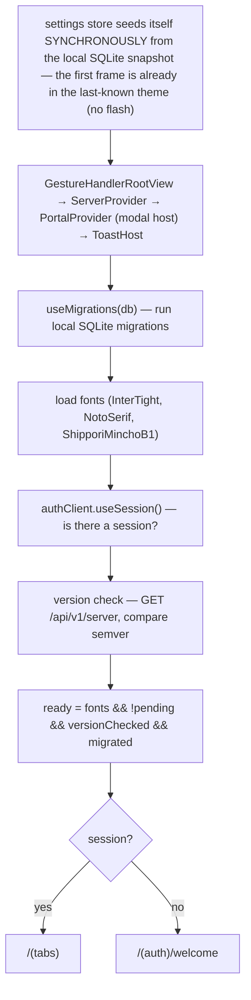

import { Aside, Steps, FileTree } from '@astrojs/starlight/components';

The client (`apps/client/`) is an **Expo / React Native** app using **Expo Router**. Its guiding principle is *deliberate simplicity*: no Redux, no DDD, no abstractions beyond Zustand. Stores are thin, services are thin helpers, and most logic lives in screens. Learn the handful of patterns below and the whole app is navigable.

## Bootstrap sequence

`app/_layout.tsx` is the ignition. On launch it runs, in order:



<Aside type="caution">
**The `everReady` ref pattern.** Once the app has been ready once, `everReady.current` is latched `true` and never reset:

```ts
const everReady = useRef(false);
if (ready) everReady.current = true;
```

This exists because `ready` flips transiently during session refreshes / SSE reconnects. Gating the UI on the raw `ready` boolean would unmount and remount the whole tree on every blip. Gate on `everReady.current` instead. **Never reset it to false** — that would blank the UI mid-session. This is also why auth routing is done by **redirecting at the root** (`app/index.tsx`) rather than with reactive `useAuth()` route guards: async guards racing against session churn are fragile; a single root redirect driven by `useSession()` is deterministic.
</Aside>

## Navigation structure

Expo Router, file-based:

<FileTree>
- app/
  - _layout.tsx        root: providers, migrations, auth, version check, ICS deep links
  - index.tsx          redirect — session ? /(tabs) : /(auth)/welcome
  - (auth)/            welcome, sign-in, sign-up
  - (tabs)/            index (calendar), calendars, agenda, settings + _layout (hydrates stores on mount)
  - onboarding/        index (profile) → calendar → sync
  - invite/[token].tsx deep-link calendar preview + accept
</FileTree>

- **Onboarding recovery** survives OAuth round-trips via module-level state in `lib/onboardingState.ts`; `(tabs)/_layout.tsx` routes to it when `settings.onboarded === false`.
- **Signed-out invite recovery** is persisted in platform SecureStore by `lib/pendingInvite.ts`. The invite route records `{ token, server }` before opening auth; successful email, Google, or Apple auth consumes it and returns to `/invite/[token]?afterAuth=1`. Accept/decline then replaces the auth history with tabs, where a new account can continue into onboarding.
- **ICS deep links** (opening a `.ics` file) are parsed in `_layout.tsx` and stashed in `useImportStore`; the calendar screen picks up the pending draft and opens the composer prefilled.
- **Android registers Musubi as a calendar app**: `plugins/withCalendarAppCategory.js` adds `APP_CALENDAR` to the launcher intent filter (default-app picker, assistant), and `app.config.ts` declares the AOSP `VIEW content://com.android.calendar` (`time/epoch`) filter so date/clock widgets offer Musubi. Manifest changes → native rebuild required.
- **Android home-screen widgets** live in the local Expo module `modules/musubi-agenda-widget/`: Kotlin `AppWidgetProvider` / `RemoteViews` render an adaptive Agenda and Calendar from the persisted snapshot built by `services/agendaWidget.ts`. Day/event/settings taps return through Expo Router, and Calendar visibility is stored per widget instance. See [Home screen widgets](/docs/guides/widgets/) for the full data flow, refresh triggers, install steps, and test checklist.

## State — Zustand stores

All in `apps/client/store/`. Stores are **API-first**: they call the server, and only write to the store + SQLite cache *after* the call succeeds. Components read from stores; they don't hold server state locally.

| Store | Owns | Key notes |
|---|---|---|
| `useEventsStore` | in-memory event list | `addEvent/updateEvent/removeEvent` (API+cache) vs `localAdd/Update/Remove` (from SSE or cache hydration); `linkEvent`/`forkEvent` |
| `useCalendarsStore` | calendars + `activeCals` filter + solo mode | **merge, don't replace** on update (see below) |
| `useSettingsStore` | preferences | **write-through persisted**: every change lands in the local SQLite blob (`cacheSetSettings`), and the store **seeds its initial state synchronously** from that snapshot (`cacheGetSettingsSync` via the raw `sqlite.getFirstSync` handle) — the very first frame is already in the last-known theme; any *async* hydrate here flashes the system theme or a blank window. The server copy (via `api.getSettings()`) still wins on refresh. `onboarded` defaults `true` so returning users never flash onboarding |
| `useImportStore` | pending ICS draft | tiny bridge between `_layout` and the calendar screen |
| `useAttendeesStore` | ephemeral attendee lists by event id | fetched when a detail modal opens, live-updated by the `attendance_changed` SSE frame; not persisted or delta-synced |
| `useEventDetailStore` / `useEditComposerStore` | the global event-detail modal + classic edit composer | written via `getState()` from screens (no subscription), rendered by `GlobalEventModals` in the tabs layout — opening a modal never re-renders the screen under it |

The highest fan-in files in the codebase are `constants/theme.ts` (40+ importers), `services/api.ts`, and these stores — treat their public shapes as load-bearing.

<Aside type="caution">
**Merge, don't replace, on calendar updates.** SSE payloads and some API responses omit fields like `role` or `provider`. Replacing the stored calendar would silently drop the user's edit rights:

```ts
// ✅ localUpdateCalendar merges
const merged = existing ? { ...existing, ...incoming } : incoming;
```
</Aside>

## Server communication

### The `useApi` hook

`services/api.ts` exposes `useApi()`, a hook returning one async method per endpoint. It's a thin wrapper over `authClient.$fetch` (Better Auth's client, which injects the session token). Requests have an 18-second abort deadline; raw and federated fetches use `lib/network.ts`'s matching `fetchWithTimeout`, so a weak connection reaches the normal error UI instead of leaving a spinner forever. Two things to know:

```ts
// Collapses the repeated error check AND preserves type narrowing:
function throwOnError(error): asserts error is null {
  if (error) { console.error("API error", error); throw new Error(`${error.status}: …`); }
}
```

The `asserts error is null` return type is load-bearing — after `throwOnError(error)`, TypeScript knows `data` is non-null. A plain `void` helper would reintroduce `data: T | null` at every call site. Also: the server returns dates as ISO strings, so methods normalise them (`start: new Date(data.start)`) before returning.

`throwOnError` is also the **session-expiry tripwire**: a 401 calls `notifySessionExpired()` (`lib/signOut.ts`), which runs the registered recovery handler once — the full `signOutAndReset` sequence — and lands the user on the welcome screen instead of every screen failing silently. `signOutAndReset` is THE sign-out path (Settings sign-out, account delete and expiry recovery all route through it): stores → SQLite mirror → scheduled notifications → native Google session → Better Auth session → redirect.

- **`contexts/ServerContext.tsx`** provides `{ apiUrl, authClient, setNewServerUrl }`. The API URL is read from `SecureStore` (defaults to prod), so self-hosters can point the app at their own server.
- **`services/auth-client.ts`** builds the Better Auth client with the Expo plugin (scheme `musubi://`, tokens in `SecureStore`).
- **`services/federation.ts`** holds the federated-server registry: member tokens for calendars shared from *other* Musubi servers, and a `calendarID → origin server` map that `useApi` consults to route writes. Calendars from federated servers carry `provider: "musubi"` + `serverUrl` and sync in `useRefreshData` after the home pull. Full picture in [Federation](/docs/architecture/federation/).

## Realtime + offline

### Delta sync

`hooks/useRefreshData.ts` is the sync orchestrator (runs on tab mount and pull-to-refresh):

<Steps>
1. **Settings first, in its own try** — `loadSettings(await api.getSettings())` runs before anything else so `onboarded` (and the theme) always arrive; a throw later in the pipeline must never gate the onboarding decision.
2. Best-effort provider sync (`api.getGoogleCalendars()`).
3. Delta fetch: `api.getEvents(since)` → `{ events, deletedIds, serverTime }`.
4. Cache: first run → `cacheReplaceAllEvents` (authoritative); delta → `cacheUpsertEvents` + `cacheDeleteEvents`. Save `serverTime` as the new cursor.
5. Reconcile membership: drop events whose calendars the user is no longer in (delta can't tombstone access loss).
6. Push into the stores.
</Steps>

<Aside type="caution">
Two traps that bit here (both iOS-only symptoms, both aborted the *whole* refresh):
- **Joining a calendar needs a full sync.** After accepting an invite, call `refresh({ full: true })` — the joined calendar's events predate the delta cursor, so a normal delta never pulls them (they'd only appear after a cache-clearing reinstall).
- **Never bind a `Date` (or `undefined`) to SQLite.** Better Auth's fetch revives ISO fields to `Date` objects, so `serverTime` arrives as a `Date`; `setLastSync` normalizes it to an ISO string. expo-sqlite on iOS throws `InvalidConvertibleException` on a `Date`/`undefined` bind (Android silently coerces). Coalesce every cached column.
</Aside>

### Offline cache

`services/eventsCache.ts` mirrors events into local **SQLite** (`services/db.ts` + drizzle, schema in `apps/client/db/schema.ts`). Dates are stored as ISO text, `calendars` as a JSON string. Always `hasValidDates()`-guard before inserting. On sign-out, `cacheClearAll()` wipes it.

Connectivity UX has two layers: `components/ui/NetworkStatusBanner.tsx` watches `expo-network` and keeps an app-wide Offline banner visible while cached data remains usable; user-triggered requests pass failures through `userFacingError()` for consistent offline, timeout, and unavailable-server copy. Pull-to-refresh exposes Retry, and the invite route has explicit loading/error/retry states. If invite acceptance succeeds but its follow-up refresh fails, the app treats the invite as accepted and lets the cache catch up later.

<Aside type="caution">
The client has its **own** drizzle schema and migrations (`apps/client/db/schema.ts`, `apps/client/drizzle/`) — separate from `packages/db` (the server's PostgreSQL). If you cache a new field, add it here and run the client's `npx drizzle-kit generate` too.
</Aside>

### Realtime

`hooks/useEventsStream.ts` opens an `EventSource` (`react-native-sse`) to `${apiUrl}/api/stream` — `apiUrl` comes from `ServerContext`, so the stream follows a self-hosted server too — authenticated with the session `Bearer` token, **plus one stream per federated server** from the registry (member token as bearer), so remote calendars' events and attendance update live too. Incoming frames (`event_created`, `event_updated`, …) are routed to the `local*` store methods; the `external_sync` frame (the server's scheduled provider sync found changes) triggers a **silent delta refresh** — `refresh({ providerSync: false })`, guarded against overlap and careful not to re-trigger the provider sync (that would loop). See the [server-side broadcast](/docs/architecture/api/#realtime-sse) and the [scheduled sync](/docs/architecture/sync/#near-realtime-the-scheduled-sync). The library auto-reconnects every 5 s after a drop; frames missed while down are covered by a one-shot silent delta refresh on the reconnect that follows an error — the delta sync remains the durable path.

## The custom calendar

Musubi does **not** use a calendar library — the month/week/day views are hand-built with **Reanimated** + **Gesture Handler** in `components/cal/`.

| File | Role |
|---|---|
| `layout.ts` | shared geometry + tuning constants (`HOUR_H`, `GUTTER`, snap sizes) and pure date/bucketing helpers (`minutesToY`, `bucketByDay`, `daySegments`, `dayKeyOf`) |
| `TimelineView.tsx` | day/week grid; pinch-zoom, drag-to-create, event move; ~3-page infinite pager. Overlapping events: **day** lays them side by side in lanes, **week** columns are too narrow — there they **cascade** (Google-mobile style: each overlap level shifts right by `CASCADE_OFFSET` and draws on top, leaving the underlying event's stripe; capped at `CASCADE_MAX_LEVELS`) |
| `MonthView.tsx` | month grid + tapped day geometry |
| `ModeSwitch.tsx` | month/week/day toggle |
| `calendar/CalendarDrillView.tsx` | shared Home/detail month → day controller, always-mounted visual preview, and viewport |

<Aside type="caution">
**The `live`-ref / shared-value pattern.** Positions, scroll offset, and zoom live in Reanimated `useSharedValue`s and refs — **not** React state — so dragging and pinching never trigger React re-renders (no layout thrash, flicker-free drops). The one deliberate exception: a `pinching` boolean flips once per pinch to disable the ScrollView's own scrolling — during a pinch the gesture is the single owner of the scroll position (two owners jittered). Gestures read a `live` ref to keep their `useMemo` dependency arrays empty.

**Mount cost is the timeline's enemy** (measured with a 2 500-event calendar): event blocks are `memo`ized — without it every 15-min ghost snap-step re-rendered every block on screen; locked (non-movable) blocks skip their `GestureDetector` entirely; and buffered pager pages defer their block mount to `requestIdleCallback`, so a mode switch mounts one page's blocks up front, not three. Month cells fit their event-row count to the real cell height (`rowsPerCell` in `MonthView`), and all-day bars shift the timed chips down **per day** — only under bars that actually cross that day. When editing `TimelineView`:

- Use `runOnJS()` to call any React setter from a gesture/worklet.
- Don't lift shared values into `useState`.
- Geometry constants belong in `layout.ts`, not inline.

This subsystem is intentionally dense; the `eslint-disable react-hooks/exhaustive-deps` comments there are deliberate, not oversights.
</Aside>

<Aside type="caution">
**All-day vs timed dates.** All-day events are anchored at **UTC midnight** and must be keyed in UTC (`dayKeyOf` / `eventDay` from `@musubi/calendar`); timed events are keyed locally. Mixing the two frames causes off-by-one-day bugs across time zones. Never do raw `new Date()` + `setDate()` arithmetic — use `dayjs`.
</Aside>

### The composer (docked vs classic)

`components/calendar/AddEventModal.tsx` has two modes, and knowing which surface uses which matters:

- **Docked** (`docked` prop) — a persistent bottom sheet that *peeks* (title + Save) and expands on pull/focus. This is the **create** path everywhere: the home tab, the agenda (FAB opens it, FAB hides while open), and the calendar-detail view (no FAB — it auto-peeks in day view and rides drag-to-create, mirroring the home model). Docked mode owns its keyboard handling: it lifts by exactly the keyboard's overlap past its resting edge and caps the lift so the sheet's top stays on screen. The resting edge is configurable via `dockBottomInset` (defaults to the tab-bar height; the detail modal passes the safe-area inset because it has no tab bar). Dismissal is two-stage: swiping down from **expanded** stops at peek, and from **peek** a further pull (60 px past, or a fling) throws the sheet away entirely — same cleanup as the X.
- **Classic modal** (no `docked`) — used only for **editing** an existing event from its detail. Its keyboard handling lives in `useModalAnimation`. It is mounted ONCE, globally (see below) — screens never render their own copy.

The [drill](/docs/architecture/glossary/#drill) (month → day transition) is shared by the Home tab and calendar detail modal through `CalendarDrillView`. It uses compositor-friendly opacity + scale transforms rather than animating `left` / `top` / `width` / `height`: the day surface fades from `0.985 → 1`, while the month fades and moves slightly deeper. A cheap day preview (header, hour grid at the real 08:45 initial scroll, plus empty space matching any all-day lanes) stays mounted even while the drill is closed, so the first frame only changes Reanimated shared values and never inserts a native tree. The real timeline mounts after the 240 ms transition, but the preview remains opaque until the active pager page reports that layout and initial scroll are ready; only then do they cross-fade over 90 ms, revealing the real events after the primary motion is complete. The calendar header never swaps subtrees: its compact year/month title remains mounted and keeps describing the source month while the shared drill progress slides a `‹ Month` button in from the left and shifts the title right; closing reverses the same transforms. The drill close still clears its React state on a **timer, not an animation callback** — an interrupted Reanimated animation silently drops its callback, which once meant a back gesture had to be done twice. That rule is documented in `useModalAnimation.ts` and in the [glossary](/docs/architecture/glossary/#timer-not-animation-callback).

### Global event modals

The event **detail** modal and the **classic edit composer** live once in `components/calendar/GlobalEventModals.tsx`, mounted in the tabs layout and driven by `useEventDetailStore` / `useEditComposerStore`. Screens open them with a store write — `presentEventDetail(events, event)` (which also resolves a tapped recurring occurrence to its series master) or `useEditComposerStore.getState().open(event)` — **never** with local `useState`: a `setState` in a heavy screen re-renders the whole calendar/agenda under the modal before it can even start animating, which read as a visible open delay. Apply the same store+host pattern to any future modal opened from a heavy screen.

The composer's RRULE build/parse logic lives in `lib/rrule.ts` and its validation in `lib/eventForm.ts` (both unit-tested — `npx tsx lib/rrule.test.ts`).

## Notifications

`services/notifications.ts` treats reminders as **derived local state** — one SQLite row per event `{ eventID, identifier, offsetMinutes, triggerDate }`, never sent to the server. `nextTrigger()` reuses `expandRecurringEvents` from `@musubi/calendar` to find the next future occurrence. Any event change calls `syncEventNotification`; a full sync calls `reconcileEventNotifications`; sign-out calls `clearAllEventNotifications`.

Notification permission is **contextual**: the app never prompts at launch. `AddEventModal` calls `requestEventNotificationPermission()` only while saving an event whose reminder toggle is on. The event API write completes before the local reminder is scheduled, so denial or a native scheduling failure cannot fail event creation/editing; the user gets a toast instead. Updating a reminder schedules and persists its replacement before cancelling the old identifier, preserving the working reminder if replacement fails.

## Help and diagnostics

Settings exposes `Feedback & Roadmap`, `Report a Problem`, Privacy, Terms, and the native version/build. Public ideas open `feedback.frgtn.dev`, where users can suggest, vote, and follow planned work. Private problem reports open a user-controlled email draft to `hello@frgtn.dev`, prefilled only with app version/build, platform/OS version, and the selected Musubi server. Calendar names, events, account email, and other user content are never attached automatically. Link-opening failures fall back to a toast with a copyable destination.

## Conventions

- **UI primitives** in `components/ui/` — use `Tap` (not bare `Pressable`; it adds press-scale + haptics), `Btn`, `Empty`, `Toast` (`showToast({ message, actionLabel, onAction })`), `confirm()`, and `ModalPortal`/`Portal` (see below). Hand-rolled equivalents get flagged in review.
- **Modals go through the Portal host — never RN `<Modal>` directly.** Every modal renders through the root `PortalProvider` (mounted in `app/_layout.tsx`, under `ServerProvider`/`SafeAreaProvider` so portaled content keeps `useServer()`/insets) via **`ModalPortal`** (`components/ui/ModalPortal.tsx`) — a drop-in for RN `<Modal>` with the same props. Why: each RN `<Modal>` is a separate **native window**, and opening one from *inside* another is broken on iOS — the inner one never appears and its transparent layer eats every touch (the app looks frozen). `ModalPortal` renders into **one in-tree host** so modals stack correctly by mount order on both platforms, and it wires the Android hardware back (RN `<Modal>`'s one freebie). Pair it with `useModalAnimation` for the fade/slide + swipe-to-dismiss. A small overlay opened from inside a modal (e.g. `ColorPickerModal`) can instead be a plain in-tree absolute overlay in its parent — same reason, never a nested `<Modal>`.
- **Theme** (`constants/theme.ts`) is a **mutable singleton**, not context: `colors`/`fonts`/`styles` are objects read at render time; `applyTheme()` swaps them in place and the tree remounts via `key={scheme}`. Read `colors.x` at render time — **never** capture a colour into a module-level constant (it freezes to whichever theme loaded first). Native light/dark splash assets and the iOS appearance-specific icons are configured in `app.config.ts`; changing them requires a native rebuild.
- **Sheet gestures must yield to horizontal children.** The shared `useModalAnimation` pan uses a vertical activation threshold and horizontal fail offset so pagers and pill rows do not wait for the sheet-dismiss gesture. Preserve those direction gates when adding gestures around a horizontally scrollable child.
- **Haptics** via `lib/haptics.ts` (`haptics.success()`, `haptics.warn()`).
- **Year display** uses the shared `YearStamp` (`components/calendar/YearStamp.tsx`) — the two-digit overlined year next to month names and as the agenda's year divider. Don't hand-roll year text.
- **React Compiler is ON** (`transform.reactCompiler`) — it auto-memoizes, so don't reach for `React.memo` by default; and **never wrap an exported component in `React.memo`** — it crashes at runtime (`Object is not a function`). Module-local memo (e.g. `TimelineEventBlock`) works.
- **Worklets capture JS refs at creation time** — a function passed to `runOnJS` must be defined *before* the gesture that references it, or the worklet captures `undefined`.
- **Timers, not animation callbacks**, for anything that must happen after an animation (closing a sheet, clearing the drill) — interrupted Reanimated animations drop their callbacks. See `useModalAnimation.ts` and the [glossary](/docs/architecture/glossary/#timer-not-animation-callback).
- Magic numbers → named constants (a `layout.ts`-style tuning block or `constants/`). Animation/gesture feel (zoom durations, snap sizes, hold delays) is all tuned in `components/cal/layout.ts` — change it there, not inline.

## How to add a screen or feature

<Steps>

1. **Screen:** add a file under `app/(tabs)/` or a route group; Expo Router auto-discovers it. Read from stores, call `useApi()`, show `showToast()` on success, `haptics.warn()` on failure.

2. **Feature touching data (end to end):**
   - Data field? → [Data Model](/docs/architecture/data-model/) (schema → migration → `packages/types` Zod).
   - Add the server endpoint → [API guide](/docs/architecture/api/#how-to-add-an-endpoint).
   - Add the `useApi` method in `services/api.ts` (`throwOnError` after the fetch).
   - Add a store action (or local screen state if trivial).
   - Wire UI → store → API. If cached, add to the client SQLite schema + a client migration.

3. **Verify:** typecheck (`cd apps/client && npx tsc --noEmit --skipLibCheck`), then test **offline** (cache), **sync**, and a **cold restart** (state should survive from the server).

</Steps>

<Aside type="tip">
Test client changes on **both iOS and Android** — the app has deliberate per-platform branches (e.g. iOS uses a file picker for `.ics`; Android uses the Storage Access Framework / `content://`).
</Aside>
