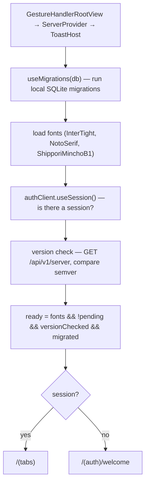

import { Aside, Steps, FileTree } from '@astrojs/starlight/components';

The client (`apps/client/`) is an **Expo / React Native** app using **Expo Router**. Its guiding principle is *deliberate simplicity*: no Redux, no DDD, no abstractions beyond Zustand. Stores are thin, services are thin helpers, and most logic lives in screens. Learn the handful of patterns below and the whole app is navigable.

## Bootstrap sequence

`app/_layout.tsx` is the ignition. On launch it runs, in order:



<Aside type="caution">
**The `everReady` ref pattern.** Once the app has been ready once, `everReady.current` is latched `true` and never reset:

```ts
const everReady = useRef(false);
if (ready) everReady.current = true;
```

This exists because `ready` flips transiently during session refreshes / SSE reconnects. Gating the UI on the raw `ready` boolean would unmount and remount the whole tree on every blip. Gate on `everReady.current` instead. **Never reset it to false** — that would blank the UI mid-session. This is also why auth routing is done by **redirecting at the root** (`app/index.tsx`) rather than with reactive `useAuth()` route guards: async guards racing against session churn are fragile; a single root redirect driven by `useSession()` is deterministic.
</Aside>

## Navigation structure

Expo Router, file-based:

<FileTree>
- app/
  - _layout.tsx        root: providers, migrations, auth, version check, ICS deep links
  - index.tsx          redirect — session ? /(tabs) : /(auth)/welcome
  - (auth)/            welcome, sign-in, sign-up
  - (tabs)/            index (calendar), calendars, agenda, settings + _layout (hydrates stores on mount)
  - onboarding/        index (profile) → calendar → sync
  - invite/[token].tsx deep-link calendar preview + accept
</FileTree>

- **Onboarding recovery** survives OAuth round-trips via module-level state in `lib/onboardingState.ts`; `(tabs)/_layout.tsx` routes to it when `settings.onboarded === false`.
- **ICS deep links** (opening a `.ics` file) are parsed in `_layout.tsx` and stashed in `useImportStore`; the calendar screen picks up the pending draft and opens the composer prefilled.

## State — Zustand stores

All in `apps/client/store/`. Stores are **API-first**: they call the server, and only write to the store + SQLite cache *after* the call succeeds. Components read from stores; they don't hold server state locally.

| Store | Owns | Key notes |
|---|---|---|
| `useEventsStore` | in-memory event list | `addEvent/updateEvent/removeEvent` (API+cache) vs `localAdd/Update/Remove` (from SSE or cache hydration); `linkEvent`/`forkEvent` |
| `useCalendarsStore` | calendars + `activeCals` filter + solo mode | **merge, don't replace** on update (see below) |
| `useSettingsStore` | preferences | hydrated by `api.getSettings()`; `onboarded` defaults `true` so returning users never flash onboarding |
| `useImportStore` | pending ICS draft | tiny bridge between `_layout` and the calendar screen |

The highest fan-in files in the codebase are `constants/theme.ts` (40+ importers), `services/api.ts`, and these stores — treat their public shapes as load-bearing.

<Aside type="caution">
**Merge, don't replace, on calendar updates.** SSE payloads and some API responses omit fields like `role` or `provider`. Replacing the stored calendar would silently drop the user's edit rights:

```ts
// ✅ localUpdateCalendar merges
const merged = existing ? { ...existing, ...incoming } : incoming;
```
</Aside>

## Server communication

### The `useApi` hook

`services/api.ts` exposes `useApi()`, a hook returning one async method per endpoint. It's a thin wrapper over `authClient.$fetch` (Better Auth's client, which injects the session token). Two things to know:

```ts
// Collapses the repeated error check AND preserves type narrowing:
function throwOnError(error): asserts error is null {
  if (error) { console.error("API error", error); throw new Error(`${error.status}: …`); }
}
```

The `asserts error is null` return type is load-bearing — after `throwOnError(error)`, TypeScript knows `data` is non-null. A plain `void` helper would reintroduce `data: T | null` at every call site. Also: the server returns dates as ISO strings, so methods normalise them (`start: new Date(data.start)`) before returning.

- **`contexts/ServerContext.tsx`** provides `{ apiUrl, authClient, setNewServerUrl }`. The API URL is read from `SecureStore` (defaults to prod), so self-hosters can point the app at their own server.
- **`services/auth-client.ts`** builds the Better Auth client with the Expo plugin (scheme `musubi://`, tokens in `SecureStore`).

## Realtime + offline

### Delta sync

`hooks/useRefreshData.ts` is the sync orchestrator (runs on tab mount and pull-to-refresh):

<Steps>
1. Best-effort provider sync (`api.getGoogleCalendars()`).
2. Delta fetch: `api.getEvents(since)` → `{ events, deletedIds, serverTime }`.
3. Cache: first run → `cacheReplaceAllEvents` (authoritative); delta → `cacheUpsertEvents` + `cacheDeleteEvents`. Save `serverTime` as the new cursor.
4. Reconcile membership: drop events whose calendars the user is no longer in (delta can't tombstone access loss).
5. Push into the stores.
</Steps>

### Offline cache

`services/eventsCache.ts` mirrors events into local **SQLite** (`services/db.ts` + drizzle, schema in `apps/client/db/schema.ts`). Dates are stored as ISO text, `calendars` as a JSON string. Always `hasValidDates()`-guard before inserting. On sign-out, `cacheClearAll()` wipes it.

<Aside type="caution">
The client has its **own** drizzle schema and migrations (`apps/client/db/schema.ts`, `apps/client/drizzle/`) — separate from `packages/db` (the server's PostgreSQL). If you cache a new field, add it here and run the client's `npx drizzle-kit generate` too.
</Aside>

### Realtime

`hooks/useEventsStream.ts` opens an `EventSource` (`react-native-sse`) to `${apiUrl}/api/stream` — `apiUrl` comes from `ServerContext`, so the stream follows a self-hosted server too — authenticated with the session `Bearer` token. Incoming frames (`event_created`, `event_updated`, …) are routed to the `local*` store methods; see the [server-side broadcast](/docs/architecture/api/#realtime-sse). There's no auto-reconnect loop — a dropped stream is picked back up by the next pull-to-refresh delta sync, which is the durable path.

## The custom calendar

Musubi does **not** use a calendar library — the month/week/day views are hand-built with **Reanimated** + **Gesture Handler** in `components/cal/`.

| File | Role |
|---|---|
| `layout.ts` | shared geometry + tuning constants (`HOUR_H`, `GUTTER`, snap sizes) and pure date/bucketing helpers (`minutesToY`, `bucketByDay`, `daySegments`, `dayKeyOf`) |
| `TimelineView.tsx` | day/week grid; pinch-zoom, drag-to-create, event move; ~3-page infinite pager |
| `MonthView.tsx` | month grid + animated drill-in to a day |
| `ModeSwitch.tsx` | month/week/day toggle |

<Aside type="caution">
**The `live`-ref / shared-value pattern.** Positions, scroll offset, and zoom live in Reanimated `useSharedValue`s and refs — **not** React state — so dragging and pinching never trigger React re-renders (no layout thrash, flicker-free drops). Gestures read a `live` ref to keep their `useMemo` dependency arrays empty. When editing `TimelineView`:

- Use `runOnJS()` to call any React setter from a gesture/worklet.
- Don't lift shared values into `useState`.
- Geometry constants belong in `layout.ts`, not inline.

This subsystem is intentionally dense; the `eslint-disable react-hooks/exhaustive-deps` comments there are deliberate, not oversights.
</Aside>

<Aside type="caution">
**All-day vs timed dates.** All-day events are anchored at **UTC midnight** and must be keyed in UTC (`dayKeyOf` / `eventDay` from `@musubi/calendar`); timed events are keyed locally. Mixing the two frames causes off-by-one-day bugs across time zones. Never do raw `new Date()` + `setDate()` arithmetic — use `dayjs`.
</Aside>

The composer (`components/calendar/AddEventModal.tsx`) is a docked bottom sheet. Its RRULE build/parse logic lives in `lib/rrule.ts` and its validation in `lib/eventForm.ts` (both unit-tested — `npx tsx lib/rrule.test.ts`).

## Notifications

`services/notifications.ts` treats reminders as **derived local state** — one SQLite row per event `{ eventID, identifier, offsetMinutes, triggerDate }`, never sent to the server. `nextTrigger()` reuses `expandRecurringEvents` from `@musubi/calendar` to find the next future occurrence. Any event change calls `syncEventNotification`; a full sync calls `reconcileEventNotifications`; sign-out calls `clearAllEventNotifications`.

## Conventions

- **UI primitives** in `components/ui/` — use `Tap` (not bare `Pressable`; it adds press-scale + haptics), `Btn`, `Empty`, `Toast` (`showToast({ message, actionLabel, onAction })`), and `confirm()`. Hand-rolled equivalents get flagged in review.
- **Theme** (`constants/theme.ts`) is a **mutable singleton**, not context: `colors`/`fonts`/`styles` are objects read at render time; `applyTheme()` swaps them in place and the tree remounts via `key={scheme}`. Read `colors.x` at render time — **never** capture a colour into a module-level constant (it freezes to whichever theme loaded first).
- **Haptics** via `lib/haptics.ts` (`haptics.success()`, `haptics.warn()`).
- Magic numbers → named constants (a `layout.ts`-style tuning block or `constants/`).

## How to add a screen or feature

<Steps>

1. **Screen:** add a file under `app/(tabs)/` or a route group; Expo Router auto-discovers it. Read from stores, call `useApi()`, show `showToast()` on success, `haptics.warn()` on failure.

2. **Feature touching data (end to end):**
   - Data field? → [Data Model](/docs/architecture/data-model/) (schema → migration → `packages/types` Zod).
   - Add the server endpoint → [API guide](/docs/architecture/api/#how-to-add-an-endpoint).
   - Add the `useApi` method in `services/api.ts` (`throwOnError` after the fetch).
   - Add a store action (or local screen state if trivial).
   - Wire UI → store → API. If cached, add to the client SQLite schema + a client migration.

3. **Verify:** typecheck (`cd apps/client && npx tsc --noEmit --skipLibCheck`), then test **offline** (cache), **sync**, and a **cold restart** (state should survive from the server).

</Steps>

<Aside type="tip">
Test client changes on **both iOS and Android** — the app has deliberate per-platform branches (e.g. iOS uses a file picker for `.ics`; Android uses the Storage Access Framework / `content://`).
</Aside>
