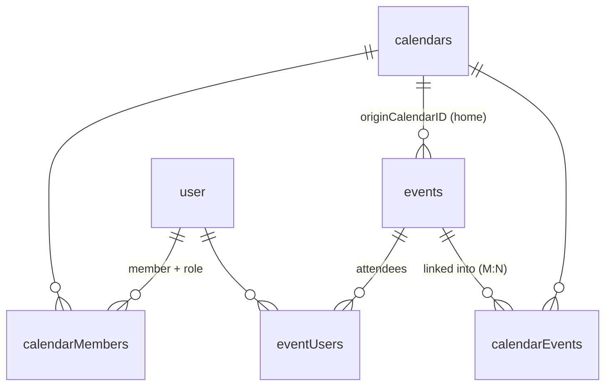

import { Aside, Steps, FileTree } from '@astrojs/starlight/components';

Everything in Musubi hangs off the database schema in **`packages/db/src/schema.ts`** (Drizzle ORM, PostgreSQL). This page is the reference for every table and — more importantly — the *why* behind the junction-table design.

<Aside type="note">
The backend **never** touches tables directly. All database access goes through the **query modules** in `packages/db/src/queries/*.ts`, re-exported from `@musubi/db`. If you're writing a handler and reach for `db.select(...)`, stop — add or reuse a query function instead.
</Aside>

## The domains

The schema is grouped into six domains by comment banners. Read them in this order.

### 1. Auth (managed by Better Auth)

| Table | Purpose | Notes |
|---|---|---|
| `user` | Core identity | `email` unique; cascades to everything the user owns. `isExternal` + `homeServer` mark a federated **shadow account** — a member whose real account lives on another Musubi server ([Federation](/docs/architecture/federation/)) |
| `session` | Bearer/session tokens | `token` unique, indexed on `userId` |
| `account` | OAuth + email/password credentials | `providerId` e.g. `"google"`; holds `accessToken`/`refreshToken` |
| `verification` | Email verify + password-reset tokens | indexed on `identifier` |

You rarely edit these — Better Auth's Drizzle adapter owns them. See [Auth in Shared Packages](/docs/architecture/packages/#auth-packagesauth).

### 2. User settings & profile

| Table | Purpose | Notes |
|---|---|---|
| `userSettings` | Preferences (theme, formats, `onboarded`, `calendarOrder` jsonb) | **Lazy-created on first read**, not at signup |
| `userAvatars` | Avatar bytes | Stored as a custom **`bytea`** type — see below |
| `userStatus` | `isSponsor` / `isPremium` flags | |

<Aside type="caution">
`userSettings` fields marked optional are **never reset by omission**. `saveUserSettings({ onboarded: undefined })` leaves the stored value untouched — intentional so partial updates don't clobber flags. To actually reset a flag, pass its explicit value.
</Aside>

### 3. Calendars & events

| Table | Purpose | Key columns |
|---|---|---|
| `calendars` | A calendar | `creatorID`, `color`, `isDefault` (one auto-created per user, undeletable) |
| `events` | An event | `title`, `start`/`end`, `isAllDay`, `hasAttendees`, `recurrence`, `creatorID`, **`originCalendarID`**, `deletedAt` |
| `calendarInvites` | Share links | `calendarID`, `expiresAt`, `maxUses` |

<Aside type="caution">
The events column is **`title`**, not `name`. Easy to trip on. And `originCalendarID` has `onDelete: "set null"` — if the home calendar is deleted, the event survives with a null home, and only the creator can then edit it (legacy fallback).
</Aside>

### 4. Link tables — the heart of the design

This is where "events beyond calendars" is implemented. **There is no `calendarId` column on `events`.** Instead:



| Table | Meaning | Cascade / constraint |
|---|---|---|
| `calendarMembers` | who is in a calendar + their `role` | cascades from user & calendar; role defaults `"viewer"`; unique `(userID, calendarID)` — re-joins hit `onConflictDoNothing` instead of duplicating |
| `calendarEvents` | which calendars an event is linked into (M:N) | cascades both sides |
| `eventUsers` | attendees of an event (creator added on create; presence = attending) | cascades both sides; unique `(eventID, userID)` |
| `calendarInvites` | invite links — the row's uuid `id` IS the token | cascades from calendar; `expiresAt` null = never expires, `maxUses` null = unlimited, `uses` counter checked (with expiry) at every token read |

**Consequences you must respect:**

- To find a user's events, you join `user → calendarMembers → calendars → calendarEvents → events`. There is no shortcut column.
- Deleting a calendar kills the events **homed** in it (`originCalendarID`) everywhere — they're tombstoned *before* the calendar row goes, because the FK would otherwise `set null` their origin and hide them. Events merely *linked* into the deleted calendar survive in their other calendars; only fully **orphaned** ones (no remaining `calendarEvents` links) are removed. See `removeCalendar()` in `queries/calendars.ts`.
- A shared event linked into 3 calendars is *one* row. Editing it edits it everywhere. That's the feature.

<Aside type="note">
`eventUsers` is the attendee list: presence in the table means attending, and anyone who can *view* the event may join/leave (`GET /events/:id/attendees`, `PUT /events/:id/attendance`). The feature is per-event opt-in via `events.hasAttendees` — a UI toggle, **non-destructive**: switching it off keeps the `event_users` rows, so re-enabling restores the same list. The payload is name + avatar only — no emails, since an event can span calendars whose members aren't mutuals. When real RSVP lands (web), add a `status` column (`yes | no | maybe`) — presence + status needs no rework. External sync inserts events directly (not via `createEvent`), so provider-imported events don't get a phantom creator-attendee.
</Aside>

### 5. External sync (provider-agnostic)

| Table | Purpose | Unique constraint |
|---|---|---|
| `externalCalendars` | maps a Musubi calendar ↔ a provider calendar | `(provider, accountID, externalCalendarID)` **and** `(calendarID)` |
| `externalEvents` | maps a Musubi event ↔ a provider event | `(provider, calendarID, externalEventID)` |
| `caldavAccounts` | CalDAV credentials | `(userID, serverUrl, username)` — multiple accounts per user |

The `(calendarID)` scoping on `externalEvents` is deliberate: two users can mirror the *same* Google calendar (e.g. a shared team calendar) and each keeps an independent mapping. CalDAV passwords in `caldavAccounts.encryptedPassword` are **AES-GCM encrypted at the app layer** — the DB never sees plaintext. Full detail in the [Sync guide](/docs/architecture/sync/).

### 6. Federation

| Table | Purpose | Notes |
|---|---|---|
| `memberTokens` | Bearer tokens for federated shadow members (origin side) | `tokenHash` unique (SHA-256 — the raw token is never stored); cascades from `user`. Authentication only — authorization stays with `calendar_members`, so a kick cuts access. |
| `musubiAccounts` | This user's connections to *other* Musubi servers (home side) | member token AES-GCM encrypted (same key as CalDAV passwords); `unique(userID, server)` — accept once, every device inherits. See [Federation](/docs/architecture/federation/). |

## The custom `bytea` type

Drizzle has no built-in `bytea`, so `schema.ts` defines a one-line custom type for `userAvatars.data`:

```ts
const bytea = customType<{ data: Buffer }>({ dataType() { return "bytea"; } });
```

Avatars live *in the database* on purpose — client-side compression keeps them ~10–20 KB, so `pg_dump` backs them up and self-hosting stays "just docker-compose". If large media (attachments) ever lands, swap S3/MinIO behind the avatar endpoints — nothing else changes.

## Soft delete → delta sync

Events are **never hard-deleted on write**. `removeEvent()` sets `deletedAt = now()`. This is what makes offline delta sync possible:

```
client: "give me everything changed since <lastSync>"
server: returns  { events: [...changed...], deletedIds: [...tombstoned...], serverTime }
client: upserts the changed events, drops the deletedIds from its cache, stores serverTime
```

Without `since`, the server returns the full active set (`deletedAt IS NULL`) and the client replaces its cache wholesale. Tombstones older than ~30 days are hard-deleted by an hourly job (`purgeDeletedEvents`). See [`useRefreshData`](/docs/architecture/client/#delta-sync).

## Query modules

`packages/db/src/index.ts` creates the Drizzle client and re-exports every query module plus the schema:

```ts
export const db = drizzle(config.db.databaseUrl, { schema });
export * from './queries/events';
export * from './queries/calendars';
// … users, settings, invites, sessions, external, caldav, oauth
export * as schema from './schema';
```

Query functions are the backend's whole DB vocabulary. Two conventions that matter:

- **They return data or `undefined`/`[]` — they do not throw `NotFound`.** Throwing is the handler's job. Keep it that way.
- **Delta-aware reads take an optional `since: Date`.** `getUsersEvents(userID, since?)` returns the full set or the changed-since set accordingly.

## Migration workflow

Migrations are generated by drizzle-kit from the schema diff and committed as SQL.

<Steps>

1. Edit `packages/db/src/schema.ts` (add/change a column, table, index, constraint).

2. Generate the migration from the diff:
   ```sh
   pnpm db:generate
   ```
   This writes a numbered `packages/db/drizzle/00XX_*.sql` plus a snapshot under `drizzle/meta/`.

3. **Review the generated SQL.** Check constraints, cascade rules, and indexes are what you intended.

4. Apply it to your local database:
   ```sh
   pnpm db:migrate
   ```

5. Commit the generated SQL and snapshot *together with* your schema change.

</Steps>

<Aside type="caution">
**Gotchas that bite:**

- **Forgetting `db:generate`** leaves the migration history out of sync with `schema.ts`; the next change will re-emit the missed diff. Always generate right after editing the schema.
- **Renames** aren't detected — drizzle-kit emits `DROP` + `CREATE` (data loss). If you need a true rename, hand-edit the migration to `ALTER TABLE … RENAME COLUMN`.
- **User deletion cascades to everything** (sessions, accounts, calendars, events, settings, avatars, external links). Test destructive changes on throwaway data.
</Aside>

## If you're adding a data field, do this in order

<Steps>
1. Add the column in `packages/db/src/schema.ts`.
2. `pnpm db:generate` → review SQL → `pnpm db:migrate`.
3. Add it to the Zod schema in `packages/types` so both apps get the type ([why](/docs/architecture/packages/#types-packagestypes)).
4. Thread it through the relevant query function, API handler, client `useApi` method, and store.
5. If the client caches it, add it to `apps/client/db/schema.ts` (the local SQLite mirror) and generate a client migration too.
</Steps>
