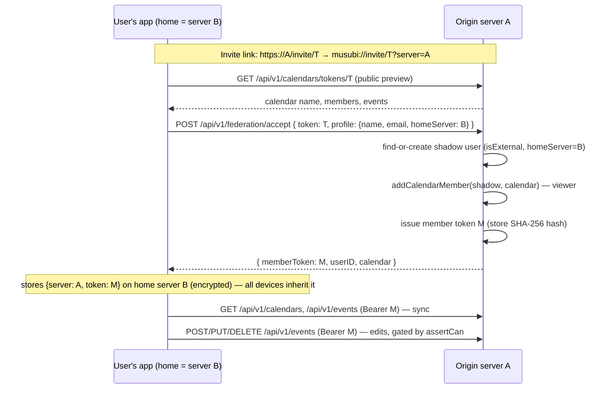

import { Aside, Steps } from '@astrojs/starlight/components';

Musubi servers can share calendars **with each other**. Someone on the hosted server can join a calendar on your self-hosted box (and vice versa) through a normal invite link — with the same roles, member management and editing as any local member. No accounts on the other server, no bridges through Google/CalDAV, no dependency on the hosted domain.

This page is the contributor's reference for how that works: the design, the trust model, every moving part, and what's deliberately deferred.

## The design in one paragraph

A calendar lives on exactly **one** server — its *origin*. An invite token is already a capability scoped to one calendar (it fetches the preview, it grants membership, it expires). Federation extends that: the invite link carries the origin server's address, and accepting it from another server runs a small handshake that creates a **shadow account** — a normal `user` row on the origin representing the remote person — adds it as a member, and issues a **member token** the invitee's app uses to read *and write* that calendar directly at its origin. Everything else (roles, permissions, attribution, member management) is the unmodified native machinery, because to the origin server the remote member **is just a user**.

## Why shadow accounts (and not a federation protocol)

The alternative — teaching `calendar_members`, event attribution and every permission query about "non-local identities" — would touch the whole data model. A shadow account inverts that: **make the remote person locally representable, and change nothing else.**

- `calendar_members` points at the shadow user; the owner promotes/demotes/kicks them with the **existing** member management UI and endpoints.
- `events.creatorID` / `organizer` attribute to the shadow user — edits show who made them.
- `assertCan` / `assertCanEditEvent` run unchanged; the origin server enforces its own permissions on every request.
- `getCalendarMembers` returns them like anyone else (name, email, avatar URL from their profile).

The `user` table gains two columns: `isExternal` (this row is a shadow account — no password, no session) and `homeServer` (their origin). That is the entire data-model footprint besides the token table.

## The pieces

### Server (origin side)

| Piece | File | What it does |
|---|---|---|
| Schema | `packages/db/src/schema.ts` | `user.isExternal` + `user.homeServer`; `member_tokens` (id, userID, `tokenHash` unique, createdAt) |
| Queries | `packages/db/src/queries/federation.ts` | `findExternalUser`, `createExternalUser`, `saveMemberToken`, `getUserByTokenHash`, `revokeMemberTokens` |
| Accept handshake | `apps/api/src/handlers/federation.ts` | `POST /api/v1/federation/accept` — public, rate-limited per IP; verifies the invite (consuming a `maxUses` use on a NEW membership), find-or-creates the shadow user, adds membership (viewer), returns the raw member token once |
| Token auth | `apps/api/src/middleware/require_auth.ts` | after the Better Auth session check fails, hashes the presented `Bearer` and looks it up in `member_tokens` — sets `req.user` to the shadow user |
| Public preview | `apps/api/src/index.ts` | `GET /api/v1/calendars/tokens/:token` is public (rate-limited per IP) — possession of the unguessable invite token is the credential; expiry and `maxUses` are enforced at every read |
| Invite page | `handlers/federation.ts` → `GET /invite/:token` | tiny HTML hand-off every server serves for its **own** invite links; deep-links `musubi://invite/<token>?server=<origin>` |
| Connection roaming | `musubi_accounts` + `GET/POST/DELETE /api/v1/users/connections/musubi` | the user's connections to *other* servers, stored on their **home** server with the member token AES-GCM encrypted (same key as CalDAV passwords) — accept once, every device inherits it |

### Client (invitee side)

| Piece | File | What it does |
|---|---|---|
| Registry | `apps/client/services/federation.ts` | federated accounts `{server, token, userID}` — **source of truth is the home server** (`getMusubiAccounts` on every refresh), SecureStore is the offline fallback cache; `calendarID → account` origin map; `fedFetch`, `acceptRemoteInvite`, `fetchRemoteCalendarPreview`, `syncFederatedAccounts` |
| Invite screen | `app/invite/[token].tsx` | reads the `?server=` param; remote → public preview + federation accept; local → the native join, unchanged |
| Sync | `hooks/useRefreshData.ts` | after the home sync, pulls calendars + events from every federated server (v1: full fetch), tags calendars `provider: "musubi"` + `serverUrl`, merges into the same stores/cache |
| Write routing | `services/api.ts` | calendar-scoped methods consult `remoteForCalendar()`; remote calendars go to their origin with the member token — same endpoints, same shapes |
| Composer guard | `components/calendar/AddEventModal.tsx` | an event's calendars must share one origin server (cross-server linking is v3) |
| Invite links | `components/calendar/CalendarSettingsModal.tsx` | built from the calendar's **own** server (`serverUrl` for federated, `apiUrl` otherwise) — no hardcoded hosted domain |

### Why the invite page matters (the "known hosts" problem)

Android app links only open the app for domains the build verifies (`musubi.pro`). A self-hosted server's `https://my-server/invite/T` can't be app-link-verified for everyone's server. So every Musubi server serves `GET /invite/:token` — a minimal HTML page that forwards into the app via the **custom scheme** (`musubi://invite/T?server=…`), which works regardless of domain. The `server` query param is what tells the app where the calendar lives.

## Trust & security model

Be precise about what protects what:

- **The member token is the security boundary.** 32 random bytes; the origin stores only its SHA-256 hash and returns the raw token exactly once. Presenting it authenticates you *as that shadow user* — nothing more.
- **Your home server holds your tokens** (in `musubi_accounts`, AES-GCM encrypted with the same key as CalDAV passwords) so connections roam across your devices. The deliberate trade-off: a home-server admin with the encryption key could act as you *on the origin calendar* — the same class of trust you already extend by storing CalDAV credentials there. Self-hosters trust themselves; hosted users trust the host.
- **Authorization is membership, always.** Every route the token reaches still runs `assertCan`/`assertCanEditEvent` against `calendar_members`. **Kicking a member cuts their access instantly**, even though their token still authenticates — it authenticates a user with no rights.
- **Profile claims are display-only.** The accept handshake trusts the submitted name/email/avatar for *display*; it grants nothing beyond what the invite token itself grants. v1 does not verify "user U really exists on server B" server-to-server — that's a v2 hardening step.
- **Shadow accounts can never collide into local accounts.** `createExternalUser` never binds to an existing local user; an email collision falls back to a synthetic unique email. An unverified email claim must not impersonate a local account — this is an invariant, keep it.
- **Invite semantics are unchanged** — same expiry/purge behaviour as a native join, same "token required, calendar id is not enough" rule.
- **Client-side routing is routing, not authorization.** `remoteForCalendar()` in the app only decides *which server to call with which credential*. It grants nothing: a client that "skips" it just sends the request to the wrong server, where `assertCan` (and the [server-side shape guards](/docs/architecture/api/#the-server-must-trust-nothing-from-the-client)) reject it. The same goes for the composer's same-server guard — it's a friendly error, the server enforces the rule regardless.

<Aside type="caution">
Known v1 gaps, deliberate and documented: no server-to-server identity proof (the invite token is the proof); member tokens don't expire (revoked implicitly by kick, `revokeMemberTokens` exists for cleanup); a shadow user with no remaining memberships lingers until cleaned up; storing connections requires `CALDAV_ENC_KEY` on the home server (without it, the accept still works but stays device-local). All are contained by the authorization-is-membership rule.
</Aside>

## What v1 is — and isn't

**v1 (this)**: the remote calendar lives *only* at its origin. The invitee's app reads and writes it there directly; a full pull per refresh keeps a device-local cache (SQLite) like any other calendar, and the app also holds an SSE stream to each federated server (member token as bearer), so remote events and attendance update live. If the origin is unreachable, the app shows the last synced copy and edits fail loudly.

**v2 — mirror (planned)**: reuse the external-provider engine (`external_calendars` / `external_events`, cursors, `upsertExternalEvent`) with a `musubi` adapter, so server B keeps a *server-side* mirror of the shared calendar. The origin stays **authoritative** — B pulls and pushes back exactly like the Google adapter, reusing the delta endpoint (`GET /events?since` → `{events, deletedIds, serverTime}`) as the cursor. No master-master merging; conflicts stay last-write-wins. This buys offline resilience (and if an origin ever disappears for good, the fork mechanic can promote a mirror into a native calendar).

**v3 — cross-server linking**: falls out of v2 almost for free — once the shared event is a real local row on B, linking it into B's own calendars is a normal in-server link. Until then the composer enforces one-origin-per-event.

## Testing it locally

<Steps>
1. Run two servers (two `.env`s, two databases, two ports) and apply migrations to both (`pnpm db:migrate`).
2. Sign in to server A (as the owner), create a calendar, share an invite — the link is `http://<A>/invite/<token>`.
3. On a device signed in to server B, open the link → the hand-off page deep-links into the app with `?server=<A>` → accept.
4. The calendar appears grouped under server A's host in the calendar list, with your role. Create/edit an event in it — the write lands on A; A's local members see it (SSE/refresh). On A, the owner sees you as a member and can change your role or kick you; after a kick, your next request fails with 403 and the next refresh drops the calendar.
</Steps>
