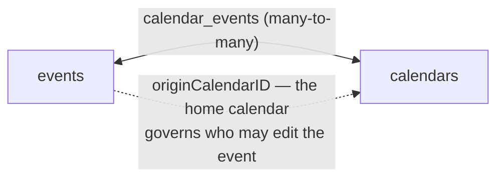
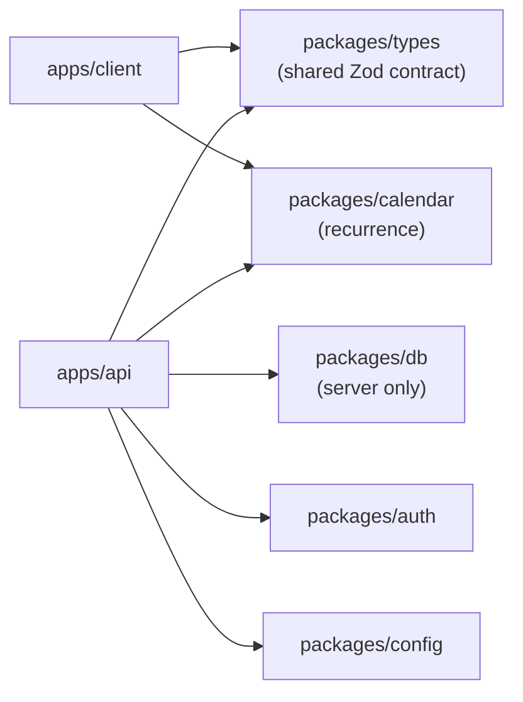
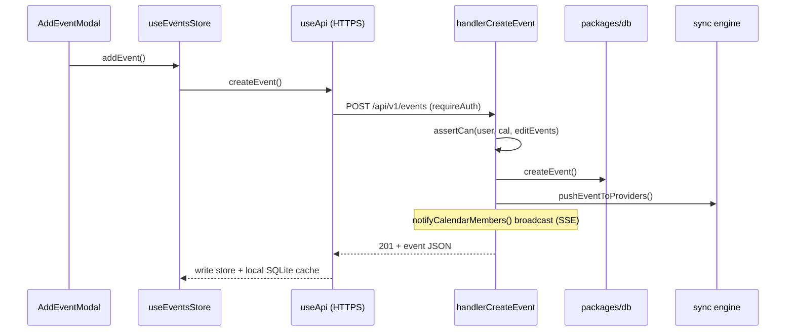

import { Aside, CardGrid, LinkCard, FileTree } from '@astrojs/starlight/components';

This section is the contributor's map of the codebase. Read this page first — it gives you the mental models that the rest of the code assumes you already have. Then jump to the part you're working on.

<CardGrid>
  <LinkCard title="Data Model" href="/docs/architecture/data-model/" description="The database schema and the events-beyond-calendars design." />
  <LinkCard title="API Server" href="/docs/architecture/api/" description="apps/api — request lifecycle, permissions, realtime." />
  <LinkCard title="Client App" href="/docs/architecture/client/" description="apps/client — Expo app, state, offline, custom calendar." />
  <LinkCard title="Sync Engine" href="/docs/architecture/sync/" description="Two-way external sync and provider adapters." />
  <LinkCard title="Shared Packages" href="/docs/architecture/packages/" description="types, calendar, auth, config — the shared contract." />
</CardGrid>

## The one idea that explains everything

Every other calendar app models data as **calendars that contain events**. Musubi inverts that:

> **An event is not owned by a calendar. It is *linked into* one or more calendars.**

A single event row can appear in your calendar, your partner's, and your team's — edited once, visible everywhere. This is the "結び (knot)" the project is named after, and it is the single most important thing to internalise. It shapes the schema (junction tables, not foreign keys), the permission model (a *home* calendar governs editing), and the sync engine (external events are linked in like any other).

Concretely:

- **Link** = the same event row gains another `calendar_events` row. One event, many calendars.
- **Fork** = a brand-new event row with a new owner. A divergent copy.
- **Home calendar** (`events.originCalendarID`) decides edit rights. You can *see* an event through any calendar it's linked into, but you can only *edit* it if you have editor/owner role on its home calendar.

Keep this diagram in your head; every subsystem is a consequence of it.

## Monorepo layout

Musubi is a **pnpm workspace** driven by **Turborepo**. Two apps, several shared packages.

<FileTree>
- apps/
  - api/          Express API server (the backend)
  - client/       Expo / React Native app (the frontend)
- packages/
  - db/           Drizzle schema, query modules, PostgreSQL migrations
  - types/        Zod schemas + inferred types — **the client/server contract**
  - calendar/     Recurrence (RRULE) expansion + date helpers — logic only, no UI
  - auth/         Better Auth configuration
  - config/       Environment loading (`envOrThrow`)
  - docs/         This documentation site (Astro Starlight)
- turbo.json      Task graph (dev/build)
- docker-compose*.yml
</FileTree>

The dependency direction is strict and worth memorising:

The client has its **own** local SQLite database (an offline mirror) — it never connects to PostgreSQL. All server data reaches the client through the HTTP API.

## The request/data flow, end to end

Here is what happens when a user creates an event on their phone:

Every write follows the same five-beat rhythm on the server — **validate → authorise → persist → sync outward → broadcast**. Learn this rhythm once and every handler reads the same way. It's spelled out in the [API guide](/docs/architecture/api/).

## The shared contract

The client and server never trust raw JSON. They communicate through **Zod schemas in `packages/types`** — `Event`, `Calendar`, `Settings`, `Invite`, the error classes, and the permission model. When you change a data shape, you change it *there first*, and both sides get the new type. This is the single source of truth; see [Shared Packages](/docs/architecture/packages/).

## Core concepts cheat-sheet

| Concept | One-line meaning | Lives in |
|---|---|---|
| **Events beyond calendars** | One event, many calendars, via `calendar_events` | `packages/db/src/schema.ts` |
| **Home calendar** | `originCalendarID` governs edit rights | `packages/db`, `apps/api/src/permissions.ts` |
| **Link vs Fork** | Share the same row vs create a divergent copy | `apps/api/src/handlers/events.ts` |
| **Roles** | owner / editor / viewer → `can(role, action)` | `packages/types/src/permissions.ts` |
| **Soft delete** | `deletedAt` tombstone drives delta sync | `packages/db/src/queries/events.ts` |
| **Delta sync** | Client asks "what changed since T?" | `apps/client/hooks/useRefreshData.ts` |
| **Mirror calendars** | External (Google/CalDAV) calendars imported as normal calendars | `apps/api/src/sync/` |
| **Recurrence** | Stored as iCal RRULE text, expanded at read time | `packages/calendar/src/recurrence.ts` |

<Aside type="tip">
The repository ships an interactive knowledge graph of itself. Run `pnpm graph` from the repo root to open a browsable map of every file, its layer, and how it connects. It's the visual companion to these docs.
</Aside>

## Where to go next

- Building a backend feature? → [API Server](/docs/architecture/api/)
- Building a screen or UI? → [Client App](/docs/architecture/client/)
- Adding a data field? → [Data Model](/docs/architecture/data-model/) then [Shared Packages](/docs/architecture/packages/)
- Integrating a calendar provider? → [Sync Engine](/docs/architecture/sync/)
- Ready to open a PR? → [Contributing](/docs/guides/contributing/)
