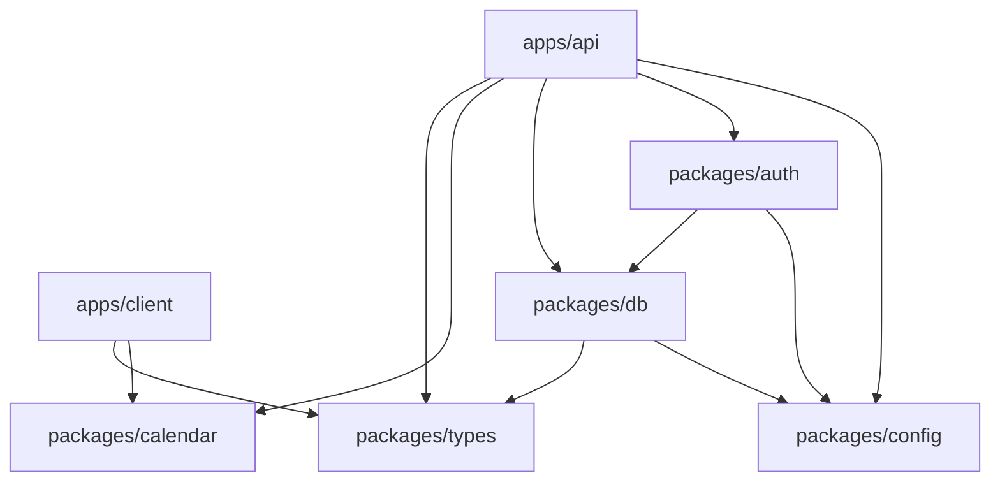

import { Aside } from '@astrojs/starlight/components';

The `packages/` workspaces hold everything shared between the two apps. `db` has its [own page](/docs/architecture/data-model/); this page covers the other four. The theme running through all of them: **define a thing once, import it everywhere.**

## types (`packages/types`)

The **client/server contract**. Every data shape is a Zod schema; the TypeScript type is inferred from it, so validation and types never drift. Both apps import from `@musubi/types` — there is no duplicated `Event` interface anywhere.

| File | Exports |
|---|---|
| `event.ts` | `EventSchema`, `Event` — `start`/`end` via `z.coerce.date()`, `calendars: string[]`, `originCalendarID` nullish, `recurrence` nullish |
| `calendar.ts` | `CalendarSchema`, `Calendar`, `CalendarWithEvents`, `providerFlavor()` (detects `"apple"` from iCloud CalDAV) |
| `settings.ts` | `SettingsSchema`, `Settings`, `CalendarView` enum |
| `invite.ts`, `user.ts`, `google.ts` | their schemas + inferred types |
| `errors.ts` | `BadRequestError`, `UnauthorizedError`, `ForbiddenError`, `NotFoundError` (each has a `kind` for HTTP mapping) |
| `permissions.ts` | `CalendarRole`, `CalendarAction`, and `can(role, action)` |

### Permissions are the single source of truth

`permissions.ts` is worth calling out because both sides depend on it:

```ts
const PERMISSIONS: Record<CalendarRole, CalendarAction[]> = {
  owner:  ["editCalendar", "deleteCalendar", "manageMembers", "editEvents", "invite"],
  editor: ["editEvents", "invite"],
  viewer: [],
};
export function can(role, action): boolean { … }
```

The **server** calls `can()` (via `assertCan`) to gate handlers; the **client** calls the same `can()` to hide or disable UI the user isn't allowed to use. If you add an action, update both the `CalendarAction` type **and** the `PERMISSIONS` record — nothing else.

<Aside type="tip">
When you change any data shape, change it **here first**. Add the field to the Zod schema, and both apps immediately get the new type. Then thread it through the DB query, handler, and client — never hand-write a matching interface on either side.
</Aside>

## calendar (`packages/calendar`)

Recurrence logic and date helpers — **pure logic, no UI** (the calendar *views* are custom in `apps/client/components/cal/`). Both apps expand RRULEs through this package.

Recurrence is stored on `events.recurrence` as **iCalendar text** — a bare `RRULE` for simple cases, or multi-line `RRULE` + `EXDATE`/`RDATE` when there are exceptions. It is expanded into individual occurrences **at read time**, never stored as instances.

`recurrence.ts` exports:

| Function | Purpose |
|---|---|
| `splitRecurrence(str)` | → `{ rrule, extras[] }` (separates the rule from EXDATE/RDATE lines) |
| `joinRecurrence(rrule, extras)` | the inverse |
| `excludeOccurrence(rec, date)` | add an `EXDATE` — "delete just this one occurrence" |
| `endSeriesBefore(rec, date)` | set `UNTIL` just before a date — "delete this and future" |
| `expandRecurringEvents(events, start, end)` | expand rules into occurrences within a window; occurrence ids are `"<id>_<startMs>"` for stable React keys |

Parsed rules are memoised in a `Map` keyed by `recurrence@dtstart` so swiping the calendar doesn't re-parse. `datetime.ts` holds the all-day handling (`eventDay()` reinterprets a UTC-midnight all-day date in the local frame); `interfaces.ts` has the minimal `ICalendarEventBase` shape the expansion works against.

<Aside type="caution">
Only ever expand recurring events for the **visible window** — never expand an unbounded series into memory. All-day recurrence needs the UTC-midnight anchor from `eventDay()`; treating those timestamps as normal times causes timezone-dependent off-by-one-day bugs.
</Aside>

## auth (`packages/auth`)

The **Better Auth** configuration (`lib/auth.ts`): the Drizzle/Postgres adapter, session + bearer + Expo plugins, email/password, and Google OAuth (`accessType: "offline"` for refresh tokens; account linking across different emails enabled).

The one hook contributors hit most: **on user creation, a default personal calendar is auto-created** (`isDefault: true`, undeletable). Every user — email or social — gets one.

<Aside type="note">
Email features (password reset) are wired but **gated at use, not boot**: if SMTP isn't configured (`config.smtp.host === ""`), the server still starts; sending just fails when attempted. This keeps local dev friction-free.
</Aside>

## config (`packages/config`)

Environment loading with a fail-fast helper:

```ts
function envOrThrow(key: string): string {
  const value = process.env[key];
  if (!value) throw new Error(`Missing value from ENV on KEY: ${key}`);
  return value;
}
```

**Required at boot** (server won't start without them): `DATABASE_URL`, `ENVIRONMENT`, `BETTER_AUTH_URL`.
**Optional, gated at use**: SMTP, Google OAuth credentials, `CALDAV_ENC_KEY`. The pattern is deliberate — a missing optional key disables *one* feature instead of crashing the server, so you can run a minimal stack locally. See [Running Locally](/docs/guides/running-locally/) for the full variable table.

`LOG_LEVEL` is optional and defaults to `info`; invalid values fail fast at boot.
The config package also exports the process-wide structured `logger`, shared by
the API and auth hooks.

## How the packages depend on each other



`packages/types` and `packages/config` are the leaves everything leans on — change them thoughtfully.
