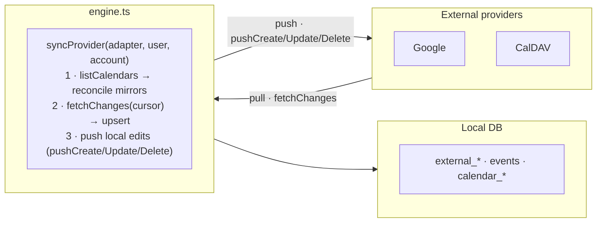

import { Aside, Steps } from '@astrojs/starlight/components';

Two-way external calendar sync is Musubi's most distinctive subsystem. It lives in `apps/api/src/sync/` and is **provider-agnostic**: the engine never talks to Google or CalDAV directly — it routes everything through a small adapter contract. Google and CalDAV are just two implementations of that contract.

## Mental model



Each connected provider account produces **mirror calendars** — ordinary Musubi calendars with an `externalCalendars` mapping. Their events flow into the unified `events` table like any other event (that's the point of "events beyond calendars"). Sync is bidirectional:

- **Pull** (provider → local): `fetchChanges` returns normalized events; the engine upserts them.
- **Push** (local → provider): editing an event in a mirror calendar calls the adapter's `pushCreate/Update/Delete`.

## The adapter contract

`sync/adapter.ts` defines three data shapes and the interface every provider implements.

```ts
type NormalizedEvent = {
  externalId: string;
  status: "active" | "cancelled";   // cancelled ⇒ delete locally
  title: string;
  start: Date; end: Date;           // UTC; all-day end is exclusive
  isAllDay: boolean;
  description: string | null; location: string | null;
  organizer: string | null;
  recurrence: string | null;        // iCal RRULE text (+ EXDATE lines)
  url: string | null;
  etag?: string | null;             // CalDAV conflict detection
};

type ExternalCalendarInfo = { externalId; name; color; readOnly?: boolean };
type FetchChangesResult   = { changes: NormalizedEvent[]; nextCursor: string | null; reset?: boolean };

interface CalendarAdapter {
  listAccounts(userID): Promise<{ id; label }[]>;
  listCalendars(userID, accountId): Promise<ExternalCalendarInfo[]>;
  fetchChanges(userID, accountId, externalCalendarId, cursor): Promise<FetchChangesResult>;
  pushCreate(userID, accountId, externalCalendarId, event): Promise<{ externalEventId }>;
  pushUpdate(userID, accountId, externalCalendarId, externalEventId, event): Promise<void>;
  pushDelete(userID, accountId, externalCalendarId, externalEventId): Promise<void>;

  // calendar-level writes — create / rename+recolor / delete the calendar itself
  createCalendar(userID, accountId, { name, color }): Promise<{ externalId }>;
  updateCalendar(userID, accountId, externalCalendarId, { name, color }): Promise<void>;
  deleteCalendar(userID, accountId, externalCalendarId): Promise<void>;
}
```

`NormalizedEvent` is the currency of the whole system — every adapter translates its provider's format to and from it.

### Calendar-level writes

Mirrors are editable and deletable from Musubi, and `POST /calendars` can create a calendar **into** a connected account. The calendar handlers apply these **provider-first**: the adapter call runs before the local write, and a provider rejection (Google refusing to delete a primary calendar, an expired token…) aborts the whole operation — Musubi and the provider never diverge. Only the user whose account backs the mirror may do this (`external_calendars.userID` check); provider-side read-only mirrors have `role: "viewer"`, so `assertCan` blocks them anyway. Provider quirks live in the adapters: Google calendar color sits on the per-user `calendarList` entry (`colorRgbFormat=true`), CalDAV uses raw `MKCALENDAR` / `PROPPATCH` (Apple `calendar-color` namespace) / `DELETE` on the collection URL.

## The engine

`sync/engine.ts` orchestrates one account at a time in `syncProvider()`:

<Steps>

1. **Reconcile calendars.** `listCalendars()` → delete local mirrors gone on the provider (`removeCalendar` cascades orphans), import new ones (`importExternalCalendar`), and refresh the read-only flag. `readOnly: true` maps to `calendar_members.role = "viewer"`.

2. **Pull events.** For each mirror, `fetchChanges(cursor)`. If `reset: true` (e.g. Google 410 cursor-expired), `clearCalendarEvents()` soft-deletes all first, then upserts fresh. Per event: `status: "cancelled"` → `deleteExternalEvent`; else `upsertExternalEvent` (transactional — creates or revives the event row + `calendar_events` + `external_events` mapping). Persist `nextCursor`.

</Steps>

`syncUser(userID)` loops every connected provider, each wrapped in try/catch so one provider failing doesn't abort the rest. A missing adapter for a provider is logged and skipped.

The CalDAV connect handler uses the same path in an account-scoped strict mode
(`syncUser(userID, { provider: "caldav", accountId, throwOnError: true })`). This
makes the first calendar/event import part of a successful connection and returns
an import failure to the client. Scheduled syncs keep the default best-effort
behaviour.

## Near-realtime: the scheduled sync

Provider changes reach the app without a manual pull-to-refresh through a three-piece loop:

1. **Scheduler** (`apps/api/src/index.ts`): every `EXTERNAL_SYNC_INTERVAL_MIN` minutes (default 5, `0` disables), the server runs `syncUser` for every user who has at least one provider mirror (`getExternalSyncUserIDs`).
2. **Change detection** (the part that makes this sane): `upsertExternalEvent` returns whether it *actually wrote* — with an etag (CalDAV) an unchanged, alive event is a verified no-op: no write, no `updatedAt` bump, so neither the broadcast nor the client delta fire for nothing. Deletions are detected by a **sweep**: on a full-set fetch (`reset: true` — CalDAV always, Google after a 410), events whose external id wasn't in the fetched set get tombstoned. The sweep replaced the old tombstone-everything-then-revive reset, which churned every event on every sync.
3. **Broadcast → silent refresh**: when a calendar really changed, `syncUser` sends an SSE `external_sync` frame to its members; the client (`useEventsStream`) responds with a *silent* delta refresh — `refresh({ providerSync: false })`, skipping the provider-sync trigger so it can't loop.

<Aside type="note">
Why polling and not push? True Google push (watch webhooks) needs a publicly reachable HTTPS endpoint plus channel management/renewal — hostile to self-hosting — and **CalDAV has no push protocol at all**. A uniform poll with real change detection gives both providers near-realtime for free. If webhook push ever lands, it slots in as an *additional* trigger for the same `syncUser` path.
</Aside>

Two correctness details worth knowing: provider **deletions tombstone** (`deletedAt`) rather than hard-delete, so offline clients learn about them through the delta's `deletedIds` (a hard delete just vanished — stale caches kept the event forever); and a client-originated push echoes back on the next poll as a write (values identical), which is harmless.

<Aside type="note">
`organizer` is `NOT NULL` in the schema but adapters may hand back `null` — the engine falls back to `""`. `color` on synced events comes from the **mirror calendar**, not the provider event.
</Aside>

## Credential crypto

`sync/crypto.ts` encrypts CalDAV passwords with **AES-256-GCM** before they hit `caldav_accounts.encryptedPassword`:

```
encryptSecret(plaintext) → "base64(iv):base64(tag):base64(ciphertext)"   (fresh 12-byte IV each time)
decryptSecret(blob)      → verifies the auth tag, throws on tampering
```

The key is `CALDAV_ENC_KEY` (64 hex chars = 32 bytes; generate with `openssl rand -hex 32`). Plaintext is decrypted only when building a CalDAV client, never stored or logged. Without the key set, CalDAV connection fails at use time (not boot).

## Provider specifics (the gotcha zones)

Most sync bugs are recurrence and all-day edge cases. The existing adapters already handle these — study them before writing a new one.

**Google (`adapters/google.ts`):**
- OAuth token refresh delegated to Better Auth (`auth.api.getAccessToken`).
- `sanitizeRecurrence()` fixes three iCal quirks: `EXDATE;TZID=…` (the rrule lib ignores TZID → convert to UTC), all-day `EXDATE` must be `VALUE=DATE`, and `FREQ=YEARLY;BYMONTHDAY` without `BYMONTH` (RFC expands monthly → anchor the month).
- Incremental sync via `syncToken`; `410 Gone` → return `reset: true`.
- All-day end is **exclusive** (±1 day on pull/push).

**CalDAV (`adapters/caldav.ts` + `caldav_client.ts`):**
- Wraps `tsdav`; Basic auth; principal/home discovery is automatic (incl. iCloud hosts).
- Events parsed via `ical.js`; `externalId` is the **resource URL**, not the UID.
- **Always returns `reset: true`** — full fetch every sync (a deliberate simplification; upgrade path is WebDAV `sync-collection`). This cleanly handles deletions.
- Passwords are trimmed (mobile clipboards add whitespace) then decrypted per request.

<Aside type="caution">
**Recurrence must round-trip on update.** When pushing an edit to a recurring event, always emit the **full** `RRULE` + all `EXDATE` lines — not a delta. Omitting them strips the recurrence off the provider's copy on every save. Both adapters do this carefully; preserve it.
</Aside>

## How to add a provider

<Steps>

1. **Create `adapters/<provider>.ts`** implementing `CalendarAdapter`. Translate the provider's API to/from `NormalizedEvent`.

2. **Credentials.** OAuth: add the provider to Better Auth (`packages/auth`), implement `listAccounts()` against the `account` table, get tokens via `auth.api.getAccessToken`. Password-based: model it on `caldav_accounts` and **encrypt with `encryptSecret()`**.

3. **`fetchChanges`.** Paginate internally, accumulate all pages into one `changes` array, return the provider's opaque `nextCursor`. Map cursor-expiry errors to `reset: true`.

4. **`push*` idempotency.** Deletes must treat 404/410 as success.

5. **Register in the engine** — add `<provider>: <adapter>` to the registry map in `engine.ts`. The `externalCalendars.provider` / `externalEvents.provider` columns are free-form strings, so **no schema change is needed**.

6. **Wire connect/disconnect handlers** (model on `handlers/caldav.ts` / `handlers/google.ts`) and trigger an initial `syncUser()`.

</Steps>

### Adapter checklist

- [ ] Cursor expiry → `reset: true` so the engine wipes and refetches
- [ ] Read-only calendars (holidays, subscriptions) → `readOnly: true`
- [ ] All-day end is exclusive — adjust ±1 day on pull/push
- [ ] Recurrence: normalise provider format to iCal RRULE; EXDATE value-type must match DTSTART
- [ ] EXDATE with a TZID → convert to UTC (rrule lib ignores TZID)
- [ ] Push includes full RRULE + EXDATE on every update
- [ ] `organizer` may be null → engine defaults to `""`
- [ ] Multiple accounts per provider supported via `listAccounts()`
- [ ] Deletes idempotent (404/410 = success)
- [ ] Calendar-level ops (`createCalendar`/`updateCalendar`/`deleteCalendar`) throw on provider rejection — the handlers rely on that to abort the local write

## Reference

| File | Contents |
|---|---|
| `sync/engine.ts` | `syncProvider`, `syncUser`, `pushEventToCalendars`, registry |
| `sync/adapter.ts` | `NormalizedEvent`, `ExternalCalendarInfo`, `FetchChangesResult`, `CalendarAdapter` |
| `sync/adapters/google.ts` | Google Calendar adapter |
| `sync/adapters/caldav.ts` + `caldav_client.ts` | CalDAV adapter (Apple/iCloud + generic) |
| `sync/crypto.ts` | AES-256-GCM `encryptSecret`/`decryptSecret` |
| `packages/db/src/queries/external.ts` | `upsertExternalEvent`, `clearCalendarEvents`, cursor & link helpers |
